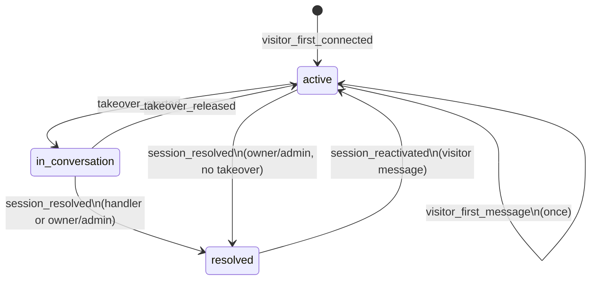

# Chat session lifecycle audit

**Status:** Implemented.

---

## Overview

Every meaningful step in a visitor chat session lifecycle is recorded as an **append-only** document in MongoDB collection `atlas_chat_session_audits`. This gives human agents and internal tooling a durable timeline: first connect, first message, human takeover, release, resolve, and reactivation.

Audit rows are **never updated or deleted** after insert. Session state (`atlas_chat_sessions.status`, `resolved_at`, etc.) is updated separately for live UI; audits are the historical record.

See also: [live-visitor-chat.md](./live-visitor-chat.md) for socket events and session status.

---

## Collection

**Name:** `atlas_chat_session_audits`

**Indexes** (`services/mongo_indexes.py`):

### `atlas_chat_session_audits`

| Index | Fields | Purpose |
| ----- | ------ | ------- |
| `audit_id_unique_index` | `audit_id` (unique) | Single-row lookup by `audit_id` |
| `agent_id_chat_session_id_created_at_index` | `agent_id`, `chat_session_id`, `created_at` (desc) | Per-session timeline (primary audit API) |
| `agent_id_created_at_index_audits` | `agent_id`, `created_at` (desc) | Agent-wide audit feed |
| `agent_id_event_type_created_at_index_audits` | `agent_id`, `event_type`, `created_at` (desc) | Filter by event (e.g. all takeovers) |
| `agent_id_actor_user_id_created_at_index_audits` | `agent_id`, `actor_user_id`, `created_at` (desc) | Filter by team member (partial — skips null actors) |
| `chat_session_id_created_at_index_audits` | `chat_session_id`, `created_at` (desc) | Session timeline when `agent_id` omitted in tooling |

### `atlas_chat_sessions` (status / resolve)

| Index | Fields | Purpose |
| ----- | ------ | ------- |
| `agent_id_status_last_message_at_index` | `agent_id`, `status`, `last_message_at` (desc) | Filter sessions by `active` / `in_conversation` / `resolved` |
| `agent_id_in_conversation_with_index` | `agent_id`, `in_conversation_with` | Find sessions held by a team member (Mongo fallback) |
| `agent_id_resolved_at_index` | `agent_id`, `resolved_at` (desc), partial `status=resolved` | Recently resolved sessions |

Existing indexes on `chat_session_id` + `agent_id`, `last_message_at`, and `team_member_ids` remain unchanged.

---

## Document schema

| Field | Type | Description |
| ----- | ---- | ----------- |
| `audit_id` | `string` | Server-generated UUID for the audit row |
| `agent_id` | `string` | Agent scope |
| `chat_session_id` | `string` | Visitor session identifier |
| `event_type` | `string` | Lifecycle event (see below) |
| `actor_type` | `string` | `visitor`, `team_member`, or `system` |
| `actor_user_id` | `string` \| `null` | Team member `user_id` when applicable; `null` for visitor-triggered events |
| `metadata` | `object` | Event-specific context (previous handler, channel, etc.) |
| `created_at` | `datetime` (UTC) | When the event occurred (stored as BSON datetime) |

**Client/API serialization:** `created_at` is formatted as ISO-8601 UTC with millisecond precision and a `Z` suffix, e.g. `2026-07-03T18:05:12.340Z` (via `format_utc_datetime_for_client`).

### Example audit document (stored)

```json
{
  "audit_id": "a1b2c3d4-e5f6-7890-abcd-ef1234567890",
  "agent_id": "695c342989c5797e0f344572",
  "chat_session_id": "web-c0430c6c-0d3f-40ef-be30-864c7b9222b7",
  "event_type": "takeover_started",
  "actor_type": "team_member",
  "actor_user_id": "67a1b2c3d4e5f6789012345a",
  "metadata": {
    "previous_in_conversation_with": null,
    "in_conversation_with": "67a1b2c3d4e5f6789012345a"
  },
  "created_at": "2026-07-03T18:10:00.120Z"
}
```

---

## Event types

| `event_type` | When recorded | `actor_type` | `actor_user_id` |
| ------------ | ------------- | ------------ | ----------------- |
| `visitor_first_connected` | New `atlas_chat_sessions` document on first visitor socket connect | `visitor` | `null` |
| `visitor_first_message` | First persisted visitor message (`role: user`) for the session | `visitor` | `null` |
| `takeover_started` | Team member starts human takeover (`atlas-team-member-start-conversation`) | `team_member` | Handler `user_id` |
| `takeover_released` | Team member ends takeover (`atlas-team-member-end-conversation`), or takeover cleared when marking resolved | `team_member` | Ending member or resolver |
| `session_resolved` | Team member marks session resolved (`atlas-team-member-resolve-session`) | `team_member` | Resolver `user_id` (member must match `in_conversation_with`; owner/admin may resolve without takeover) |
| `session_reactivated` | Visitor sends a new message after `status: resolved` | `visitor` | `null` |

### Idempotency

| Event | Guard |
| ----- | ----- |
| `visitor_first_connected` | Only when `ensure_chat_session_for_visitor` inserts a new session |
| `visitor_first_message` | Only when `first_message_at` is set for the first time on the session |
| `takeover_started` | Only when `in_conversation_with` changes to a new handler |
| `takeover_released` | Only when clearing a non-null previous handler |
| `session_resolved` | Skips duplicate audit if session is already `resolved` (ack still succeeds) |
| `session_reactivated` | Only when current status is `resolved` |

---

## Session fields updated alongside audits

| Session field | Set when |
| ------------- | -------- |
| `first_message_at` | First visitor message |
| `status` | `active` / `in_conversation` / `resolved` |
| `resolved_at`, `resolved_by` | Mark resolved |
| `resolved_at`, `resolved_by` cleared | Reactivated by visitor message |

---

## Code references

| Piece | Location |
| ----- | -------- |
| Audit insert + fetch | `services/elysium_atlas_services/atlas_chat_session_audit_services.py` |
| First connect audit | `ensure_chat_session_for_visitor` in `atlas_chat_session_services.py` |
| First message audit | `maybe_record_visitor_first_message_audit` (called from `create_and_store_chat_messages`) |
| Takeover start/release audits | `persist_in_conversation_with` |
| Resolve + reactivate | `mark_chat_session_resolved`, `reactivate_chat_session_if_resolved` |
| Resolve socket handler | `team_member_resolve_session_controller` |
| Status constants | `config/atlas_chat_config.py` |

---

## Reading audits (service — ready for HTTP)

### Per-session timeline (paginated)

```python
from services.elysium_atlas_services.atlas_chat_session_audit_services import query_chat_session_audits

result = await query_chat_session_audits(
    agent_id,
    chat_session_id=chat_session_id,
    page=1,
    limit=50,
)
# result: { success, audits, total, page, limit, total_pages, has_next, has_prev }
```

### Agent-wide feed with filters

```python
result = await query_chat_session_audits(
    agent_id,
    event_type="takeover_started",   # optional
    actor_user_id=team_member_id,    # optional
    page=1,
    limit=50,
)
```

### Single row by audit_id

```python
from services.elysium_atlas_services.atlas_chat_session_audit_services import get_chat_session_audit_by_audit_id

row = await get_chat_session_audit_by_audit_id(agent_id, audit_id)
```

### Convenience (non-paginated, session scope)

```python
from services.elysium_atlas_services.atlas_chat_session_audit_services import get_chat_session_audits

rows = await get_chat_session_audits(agent_id, chat_session_id, limit=100)
```

No HTTP route is wired yet. When adding APIs, prefer `query_chat_session_audits` with JWT + team membership checks on `agent_id`.

---

## Lifecycle diagram


