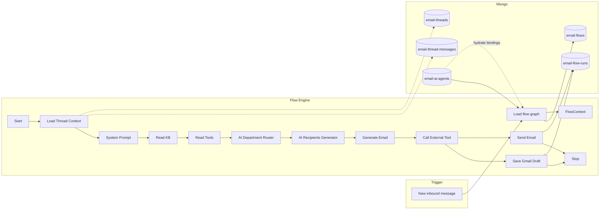

# Email Flow Engine — Architecture & Implementation Plan

How to combine **thread context**, **system prompt**, **knowledge base (RAG)**, **tools**, and **department rules** into a node-based workflow that produces meaningful email responses — with a default flow for every agent and optional custom flows for power users.

**Status:** Planning document (not yet implemented)

**Related docs:**
- [email-ai-agent-setup.md](./email-ai-agent-setup.md) — agent config, Gmail sync, threads, [agent ↔ workflow sync](./email-ai-agent-setup.md#agent--workflow-sync)
- [email-knowledge-api.md](./email-knowledge-api.md) — KB indexing & retrieval
- [email-tool-definitions-api.md](./email-tool-definitions-api.md) — register tools for LLM
- [email-tools-api.md](./email-tools-api.md) — tool execution (tickets, etc.)
- [email-routing-rules-api.md](./email-routing-rules-api.md) — department routing rules per team

---

## 1. Problem statement

Today we can:

1. **Read email** — sync Gmail threads into `email-threads` and `email-thread-messages`
2. **Configure an agent** — `system_prompt`, `knowledge_id`, `tool_ids`, `llm_model`, Gmail inbox
3. **Retrieve knowledge** — Qdrant RAG via `retrieve_relevant_knowledge_chunks()` (top 5 chunks)
4. **Register & execute tools** — HTTP tool definitions + built-in ticket APIs

What we **cannot** do yet is **orchestrate** these pieces into a repeatable, auditable pipeline that turns an inbound message into a draft (or sent) reply — with optional routing, CC/BCC rules, and external CRM actions.

The email flow engine closes that gap by running a **directed graph of nodes** (like a workflow builder) for each qualifying inbound message.

---

## 2. Goals

| Goal | Description |
|------|-------------|
| **Composable pipeline** | Each step is a node with inputs/outputs; edges define execution order |
| **Default out of the box** | Every new agent gets a non-deletable default workflow — regular users need zero setup |
| **Power-user customization** | Teams can clone/edit flows, attach a different `flow_id` to an agent |
| **Bidirectional sync** | Agent settings and workflow node config stay aligned — edits on either side update the other (see §5.2) |
| **Trigger on sync** | When sync stores a **new inbound** message, enqueue a flow run for that thread |
| **Shared context** | All nodes read/write a common **flow context** object (thread, KB chunks, tool results, routing, draft body, etc.) |
| **Policy-driven final action** | Agent `reply_action` decides **draft** vs **auto-send** (with confidence threshold) |

---

## 3. User tiers

### 3.1 Regular users

- Create agent → default workflow is attached automatically
- Sync inbox → inbound messages are processed silently through the default pipeline
- Review AI output in the app (draft ready in inbox or internal UI)
- No node editor exposed

### 3.2 Power users

- View default workflow (read-only reference)
- **Clone** default → edit nodes, prompts, conditions, tool wiring
- Attach custom `flow_id` to one or more agents
- Visual flow builder in frontend using **[@xyflow/react](https://reactflow.dev)** — same JSON graph stored in Mongo (see §11)

---

## 4. High-level architecture

```
Gmail sync stores new inbound message
        ↓
Flow trigger service (per agent.flow_id)
        ↓
Load flow graph from email-flows
        ↓
Create flow run record (email-flow-runs)
        ↓
Execute nodes in topological order
        ↓
Each node reads/writes FlowContext
        ↓
Final Action node → **Save Gmail Draft** or **Send Email** (from agent `reply_action`) → Stop
        ↓
Persist run result + update thread/message metadata
```



**Tail node:** Only **one** of `Save Gmail Draft` or `Send Email` is active on the canvas per agent — see §5.2.

---

## 5. Default workflow (non-deletable)

Every agent starts with this linear graph. Power users may fork it; the system seed **`default_email_agent_flow_v1`** cannot be deleted.

**Shared prefix (all agents):**

```
Start
  → Load Thread Context
  → System Prompt
  → Read KB
  → Read Tools
  → AI Department Router
  → AI Recipients Generator
  → Generate Email
  → Call External Tool (optional — skipped when no post-draft tools)
  → [tail node — depends on agent.reply_action.mode]
  → Stop
```

**Tail node (mutually exclusive — one per agent):**

| `agent.reply_action.mode` | Last action node on canvas | Runtime behaviour |
| ------------------------- | -------------------------- | ----------------- |
| **`draft`** | **Save Gmail Draft** (`save_gmail_draft`) | Always create a Gmail draft on the thread |
| **`auto_send`** | **Send Email** (`send_email`) | Send if confidence ≥ `auto_send_min_confidence`; otherwise run **Save Gmail Draft** internally (fallback — not shown as a second canvas node) |

When the user changes `reply_action.mode` on the agent (create/update API), the workflow canvas **swaps the tail node** — no separate flow document required for draft vs send.

```
reply_action.mode = draft
  ... → Call External Tool → Save Gmail Draft → Stop

reply_action.mode = auto_send
  ... → Call External Tool → Send Email → Stop
     (runtime: confidence < threshold → Save Gmail Draft, then Stop)
```

### 5.2 Agent ↔ flow synchronization (bidirectional)

The **agent document** (`email-ai-agents`) and the **workflow graph** (`email-flows`) must always show the **same** KB, tools, prompt, model, and reply policy. Sync works **both ways**:

| Direction | Who edits | What happens |
| --------- | --------- | ------------ |
| **Agent → flow** | Agent settings (create/update API) | Flow node `config` + canvas `binding` updated to match agent |
| **Flow → agent** | Workflow builder (save flow, pick KB/tools on nodes) | Agent document **auto-updated** from flow node selections |
| **Attach flow** | User sets `flow_id` on agent (or “attach workflow”) | One-time **flow → agent** sync so agent reflects that flow’s node config |

**Runtime rule:** The flow engine still loads **`email-ai-agents`** at execution time (`knowledge_id`, `tool_ids`, etc.). Flow → agent sync ensures the agent doc is never stale after workflow edits.

See also: [Agent ↔ workflow sync](./email-ai-agent-setup.md#agent--workflow-sync) in the agent setup doc.

#### Syncable fields (both documents)

| Field | Flow node | Stored on flow node | Stored on agent |
| ----- | --------- | ------------------- | --------------- |
| `knowledge_id` | `read_kb` | `config.knowledge_id` | `knowledge_id` |
| `tool_ids` | `read_tools` | `config.tool_ids` | `tool_ids` |
| `system_prompt` | `system_prompt` | `config.system_prompt` | `system_prompt` |
| `llm_model` | `generate_email` | `config.llm_model` | `llm_model` |
| `reply_action` | `save_gmail_draft` / `send_email` (tail) | `config.reply_action` | `reply_action` |
| `department_rules` (future) | `ai_department_router` | `config.department_rules` | `department_rules` |
| `recipient_rules` (future) | `ai_recipients_generator` | `config.recipient_rules` | `recipient_rules` |

**Agent-only (not driven by flow):** `name`, `gmail_account_id`, `user_id`, `team_id`, sync state.

**Flow-only (not copied to agent):** `generate_email.format_prompt`, `read_kb.limit`, `call_external_tool.tools[]`, node positions, edges.

#### Binding map (what each node shows)

| Agent / flow value | Flow node `type` | Canvas label |
| ------------------ | ---------------- | ------------ |
| `gmail_account_id` + inbox email | `load_thread_context` | Inbox: `support@gmail.com` (agent-only) |
| `system_prompt` | `system_prompt` | Truncated preview |
| `knowledge_id` + title | `read_kb` | `Return Policy` · `a1b2c3d4-...` |
| `tool_ids` + names | `read_tools` | `Get Ticket Status`, `Create Ticket`, … |
| `llm_model` | `generate_email` | `gpt-4o-mini` |
| `reply_action` | tail node | `Draft only` or `Auto-send ≥ 0.8` |

#### Sync triggers (backend)

```
┌─────────────────────┐         ┌─────────────────────┐
│  POST agent update  │ ──────► │  push_agent_to_flow │
│  (settings page)    │         │  update flow nodes  │
└─────────────────────┘         └─────────────────────┘

┌─────────────────────┐         ┌─────────────────────┐
│  POST flow update   │ ──────► │  push_flow_to_agent │
│  (workflow save)    │         │  update agent doc   │
└─────────────────────┘         └─────────────────────┘
         │
         └── for every agent where agent.flow_id = this flow_id

┌─────────────────────┐         ┌─────────────────────┐
│  attach flow_id to  │ ──────► │  push_flow_to_agent │
│  agent (update)     │         │  (once on attach)   │
└─────────────────────┘         └─────────────────────┘
```

**`push_flow_to_agent(flow_id, agent_id)`** — read syncable node `config` from flow → `$set` matching fields on `email-ai-agents`.

**`push_agent_to_flow(agent_id)`** — read agent fields → `$set` matching node `config` on linked flow (keeps flow JSON aligned when user edits agent settings).

Both run after successful create/update. Frontend should re-fetch agent + flow after either operation.

#### Example: KB changed on workflow

1. Power user opens custom flow, selects **Return Policy v2** on **Read KB** node, saves flow (`POST /email-flows/v1/update`).
2. Backend runs `push_flow_to_agent` for agent `A` where `A.flow_id` = this flow.
3. Agent `A` now has `knowledge_id` = Return Policy v2 UUID — visible on agent settings and `GET /get-agent`.
4. Regular user on agent settings sees updated KB without editing agent form manually.

#### Example: tools changed on agent settings

1. User updates agent `tool_ids` via `POST /email-ai-agents/v1/update`.
2. Backend runs `push_agent_to_flow`.
3. **Read Tools** node on linked flow gets `config.tool_ids` updated; workflow canvas shows new tools on next load.

#### Shared flows (multiple agents)

If two agents share the same custom `flow_id`, saving the flow runs **flow → agent** sync for **both** agents (same KB/tools/prompt on each). Product may later restrict one-flow-one-agent; document current behaviour as team template pattern.

#### Hydrated response for frontend (`get-flow-for-agent`)

Merge **flow node `config`** (canonical for power-user edits) with **agent** (canonical at runtime) — they must match after sync. Response includes `binding` for display:

```json
{
  "flow_id": "...",
  "agent_id": "...",
  "sync_status": "in_sync",
  "nodes": [
    {
      "node_id": "read_kb",
      "type": "read_kb",
      "label": "Read KB",
      "position": { "x": 250, "y": 300 },
      "config": {
        "limit": 5,
        "knowledge_id": "a1b2c3d4-e5f6-7890-abcd-ef1234567890"
      },
      "edges": [{ "to": "read_tools" }],
      "binding": {
        "knowledge_id": "a1b2c3d4-e5f6-7890-abcd-ef1234567890",
        "title": "Return Policy",
        "synced_from": "flow"
      }
    },
    {
      "node_id": "read_tools",
      "type": "read_tools",
      "config": {
        "tool_ids": ["674d1a2b3c4e5f6789012345", "674d2b3c4d5e6f7890123456"]
      },
      "binding": {
        "tools": [
          { "tool_id": "674d1a2b3c4e5f6789012345", "display_name": "Get Ticket Status" },
          { "tool_id": "674d2b3c4d5e6f7890123456", "display_name": "Create Ticket" }
        ],
        "synced_from": "flow"
      }
    }
  ]
}
```

**Frontend (`@xyflow/react`):** Power users edit KB/tools on node panel → save flow → agent settings refresh automatically (re-fetch agent). Agent settings edits → save agent → workflow canvas refresh.

#### Tail node resolution (backend + UI)

1. Load flow template from `email-flows` (may store `tail_node: "resolved"` placeholder or both types with one marked `inactive`).
2. Load agent by `agent.flow_id` owner / `agent_id`.
3. Replace tail:
   - `draft` → include `save_gmail_draft`, omit `send_email`
   - `auto_send` → include `send_email`, omit `save_gmail_draft`
4. Hydrate all `binding` objects (titles, tool names, inbox email) from synced `config` + lookups.

Changing KB on the **workflow** → `push_flow_to_agent` → agent settings show new KB.  
Changing KB on **agent settings** → `push_agent_to_flow` → workflow node shows new KB.

### 5.3 Node reference

Each node has:

- **`node_id`** — stable id within the flow (e.g. `load_thread_context`)
- **`type`** — handler key the engine dispatches to
- **`config`** — node-specific settings (prompts, limits, templates)
- **`edges`** — `{ "next": "node_id" }` or conditional edges (future)

All nodes share a **`FlowContext`** (see §7).

---

#### Node: **Start**

**Purpose:** Entry point; validate that a flow run is allowed.

**Inputs:** `agent_id`, `thread_id`, `trigger_message_id` (the new inbound message that triggered the run)

**Actions:**
- Load agent; verify `status === "active"`
- Verify trigger message exists, `direction === "inbound"`, `status === "stored"`
- Skip if message already has `flow_run_id` or `processing_status !== "pending"` (idempotency)
- Initialize empty `FlowContext`

**Outputs:** `context.run_id`, `context.trigger_message`

**Config:** none

---

#### Node: **Load Thread Context**

**Purpose:** Load the full conversation the AI will reply to.

**Agent binding:** `agent.gmail_account_id` → inbox `email_address` / `inbox_name`.

**Actions:**
- Fetch all messages for `thread_id` + `gmail_account_id`, oldest-first (same as `get-thread` without pagination limit for MVP, or cap at N with “summary of older” later)
- Build `context.thread`:
  - `thread_id`, `subject`, `participants`, `message_count`
  - `messages[]` — trimmed bodies for LLM (prefer `body_text`; strip excessive quoting if needed)
  - `latest_inbound` — the message that triggered the run
- Load thread summary from `email-threads` (`department_id`, `assigned_user_id` if already set)

**Outputs:** `context.thread`, `context.compressed_query` (see below)

**Compressed query (for KB):** Long threads must not be embedded verbatim. Build a short retrieval query, e.g.:

```
subject + latest_inbound.snippet + last 1–2 inbound body paragraphs (max ~500 chars)
```

Optionally use a cheap LLM call: “Summarize the customer’s current ask in one sentence.”

**Reuses:** `email_thread_services` message fetch patterns from [email-ai-agent-setup.md](./email-ai-agent-setup.md).

---

#### Node: **System Prompt**

**Purpose:** Load agent instructions into the LLM system layer.

**Agent binding:** `agent.system_prompt` — shown on canvas as read-only preview.

**Actions:**
- Read `agent.system_prompt` from `email-ai-agents`
- Set `context.system_prompt`
- Optionally merge agent-level **tone/format defaults** (future field on agent)

**Outputs:** `context.system_prompt`

**Config:** none — prompt is edited on the agent, not in the flow builder

---

#### Node: **Read KB**

**Purpose:** RAG — fetch top relevant knowledge chunks for this thread.

**Agent binding:** `config.knowledge_id` on the flow node (synced with `agent.knowledge_id`) + title lookup — canvas shows the KB selected on the workflow or agent settings.

**Actions:**
- Resolve `knowledge_id` from agent (after sync) or node `config.knowledge_id`
- If `agent.knowledge_id` is empty → skip, set `context.kb_chunks = []`
- Call `retrieve_relevant_knowledge_chunks(knowledge_id, context.compressed_query, limit=5)`
- Store chunks in `context.kb_chunks` with scores and `text_content`

**Outputs:** `context.kb_chunks`, `context.kb_title`

**Config:**
- `knowledge_id` — syncable with agent; editable on workflow node (power users)
- `limit` (default `5`, matches `RELEVANT_CHUNKS_LIMIT` in code today)
- `min_score` (optional threshold to drop weak matches)

**Reuses:** [email-knowledge-api.md](./email-knowledge-api.md) retrieval service (not the public query API).

---

#### Node: **Read Tools**

**Purpose:** Decide which registered tools are needed **now** and execute them **before** drafting the reply.

**Agent binding:** `config.tool_ids` on the flow node (synced with `agent.tool_ids`) — canvas lists tools selected on the workflow or agent settings.

**Actions:**
1. Load tool definitions from node `config.tool_ids` / `agent.tool_ids` (must match after sync)
2. Format with `format_tool_for_llm()` (already exists)
3. **LLM planning call** — given thread summary + KB snippets + tool descriptions, return:
   - `tools_to_call: [{ name, arguments }]`
   - or `tools_to_call: []` if none needed
4. Execute each tool via HTTP (`endpoint_url`, `http_method`, body/query)
5. Append results to `context.tool_results[]`:
   ```json
   {
     "tool_name": "get_ticket_status",
     "arguments": { "ticket_number": "TKT-1001" },
     "success": true,
     "response": { "ticket": { ... } }
   }
   ```

**Outputs:** `context.tool_results`, `context.tools_planned`

**Config:**
- `tool_ids` — syncable with agent; editable on workflow node (power users)
- `max_tool_calls` (default `3`)
- `skip_if_no_ticket_mention` (heuristic fast-path, optional)

**Reuses:** [email-tool-definitions-api.md](./email-tool-definitions-api.md), [email-tools-api.md](./email-tools-api.md).

**Note:** This is **separate** from the optional **Call External Tool** node at the end (post-draft CRM actions). Read Tools = gather facts for the reply; Call External Tool = side effects after the draft is ready.

---

#### Node: **AI Department Router**

**Purpose:** Assign the thread to a department using AI + rules.

**Agent binding:** Team **`email-routing-rules`** (active rules for `team_id`) — canvas shows rule count + link to rules admin; not stored on agent doc.

**Actions:**
- Load all **active** routing rules for `agent.team_id` from `email-routing-rules` (via `list_team_routing_rules` service)
- Load department names/descriptions from `email-departments`
- LLM call with:
  - System: routing instructions + department list (name + description)
  - User: thread context + KB summary + tool results
- Output structured JSON:
  ```json
  {
    "department_id": "674a1b2c3d4e5f6789012345",
    "confidence": 0.92,
    "reason": "Customer asks about enterprise pricing"
  }
  ```
- Update `email-threads.department_id` (and optionally `assigned_user_id` if rules specify)

**Outputs:** `context.routing.department_id`, `context.routing.reason`

**Config:** none — rules managed via [email-routing-rules-api.md](./email-routing-rules-api.md)

**Fallback:** Rule with `is_fallback: true` for the team when LLM finds no strong match

**Reuses:** [departments-api.md](./departments-api.md), existing thread visibility filters in `email_thread_services`.

---

#### Node: **AI Recipients Generator**

**Purpose:** Decide To / CC / BCC for the **outgoing** reply.

**Data source:** Team **`email-recipient-rules`** ([email-recipient-rules-api.md](./email-recipient-rules-api.md)) — **not** tied to routed department.

**Independence:** Runs after **AI Department Router** but does **not** require CC/BCC users to be in the routed department. Cross-department CC/BCC is allowed (only `team_id` is validated on `user_id`s).

**Actions:**
- Default To: reply to latest inbound sender (respect `Reply-To` if present on trigger message)
- Load active **recipient rules** for `agent.team_id`
- LLM evaluates `recipient_prompt` per rule → merge matching `cc_user_ids` / `bcc_user_ids` → resolve emails from `email-users`
- Output:
  ```json
  {
    "to": ["customer@example.com"],
    "cc": ["founder@company.com"],
    "bcc": ["legal@company.com"]
  }
  ```

**Outputs:** `context.recipients`

**Config:** none on flow node — rules managed via recipient-rules API

---

#### Node: **Generate Email**

**Purpose:** Produce the reply body (and subject if needed).

**Agent binding:** `agent.llm_model` — shown as model badge on the node.

**Actions:**
- Build LLM messages:
  - **System:** `context.system_prompt` + KB chunks + tool results + formatting instructions
  - **User:** full thread transcript (or summarized) + “Write the reply to the latest customer message”
- Apply **format prompt** from node config (how the body should look)
- Optional **template** — wrap body in HTML/text template with placeholders
- Output:
  ```json
  {
    "subject": "Re: Refund request",
    "body_text": "...",
    "body_html": "..." 
  }
  ```

**Outputs:** `context.draft` (includes `confidence` 0–1 for the Send Email node)

**Config (node-level):**
- `format_prompt` — e.g. “Professional, concise, under 200 words, bullet points for action items”
- `template_id` / `body_template` — optional wrapper
- `include_signature` — bool (future: agent signature block)

**Model:** `agent.llm_model`

---

#### Node: **Call External Tool** (optional)

**Purpose:** Post-draft side effects — create CRM ticket, update deal stage, webhook, etc.

**Actions:**
- Only run if `context.post_draft_actions` or node config lists tools to invoke after draft
- Same HTTP executor as Read Tools, but triggered by explicit config or a second LLM pass: “Given this draft, should we create a ticket?”
- Store in `context.external_actions[]`

**Outputs:** `context.external_actions`

**Config:**
- `tools[]` — allowlist of tool_ids eligible for post-draft calls
- `auto_create_ticket_if_unresolved` — bool (example policy)

**Default flow behavior:** Node is present but **pass-through** when no tools configured — engine skips HTTP calls.

---

#### Node: **Save Gmail Draft**

**Purpose:** Save the generated reply as a **Gmail draft** on the thread in the user's inbox.

**When shown:** `agent.reply_action.mode === "draft"` — this is the **tail node** on the canvas (replaces Send Email).

**Agent binding:** `agent.reply_action` — canvas label e.g. **Draft only**.

**Actions:**
- Create Gmail draft via Gmail API (thread-scoped)
- Persist draft metadata (`email-ai-drafts`, optional)
- Update trigger message `processing_status = "completed"`
- Update thread `last_ai_processed_at`

**Outputs:** `context.final_action` — `{ type: "draft", gmail_draft_id }`

**Config:** none — behaviour driven entirely by agent `reply_action.mode === "draft"`

---

#### Node: **Send Email**

**Purpose:** Send the generated reply automatically when confidence is high enough.

**When shown:** `agent.reply_action.mode === "auto_send"` — this is the **tail node** on the canvas (replaces Save Gmail Draft).

**Agent binding:** `agent.reply_action` — canvas label e.g. **Auto-send ≥ 0.8** (`auto_send_min_confidence`).

**Actions:**
- Read `context.draft.confidence` (produced by Generate Email or a dedicated scoring step)
- If `confidence >= agent.reply_action.auto_send_min_confidence` → send via Gmail API
- If below threshold → **fallback:** execute Save Gmail Draft logic (same as draft mode), set `context.final_action.type = "draft"` with reason `confidence_below_threshold`
- Update processing status and thread metadata

**Outputs:** `context.final_action` — `{ type: "sent" | "draft", gmail_message_id?, gmail_draft_id?, fallback_reason? }`

**Config:** none — threshold comes from agent `reply_action.auto_send_min_confidence`

---

#### Node: **Stop**

**Purpose:** Terminal node; mark run complete.

**Actions:**
- Set flow run `status = "completed"`
- Write execution log (per-node timings, errors)
- Emit event for frontend (future: websocket / poll)

---

## 6. When flows run (triggers)

### 6.1 Primary trigger — sync

After `run_agent_inbox_sync` inserts a **new inbound** message:

```
if message.direction == "inbound" and message.status == "stored":
    enqueue_flow_run(agent_id, thread_id, message_id)
```

- **One run per new inbound message** (not per sync batch)
- If multiple new messages arrive in one thread during sync, either:
  - **MVP:** one run on the newest inbound only, or
  - **Later:** one run per message, queued FIFO

### 6.2 Future triggers

- Gmail push (`historyId`) instead of poll sync
- Manual “Re-run AI” button on a thread
- Scheduled re-process for stale drafts

### 6.3 What does **not** trigger a flow

- Outbound messages (`direction === "outbound"`)
- Duplicate messages (dedup already in sync)
- Agent `status !== "active"`
- Message already processed (`processing_status !== "pending"`)

---

## 7. FlowContext (shared state)

All nodes read and write a single JSON-serializable object persisted on the flow run document.

```json
{
  "run_id": "uuid",
  "agent_id": "...",
  "team_id": "...",
  "thread_id": "...",
  "trigger_message_id": "...",

  "system_prompt": "...",
  "compressed_query": "...",

  "thread": {
    "subject": "...",
    "participants": [],
    "messages": [],
    "latest_inbound": {}
  },

  "kb_chunks": [
    { "text_content": "...", "score": 0.89, "text_index": 0 }
  ],

  "tool_results": [],
  "tools_planned": [],

  "routing": {
    "department_id": "...",
    "reason": "..."
  },

  "recipients": {
    "to": [],
    "cc": [],
    "bcc": []
  },

  "draft": {
    "subject": "...",
    "body_text": "...",
    "body_html": "...",
    "confidence": 0.92
  },

  "external_actions": [],

  "final_action": {
    "type": "draft",
    "gmail_draft_id": "..."
  },

  "errors": [],
  "node_logs": [
    { "node_id": "read_kb", "started_at": "...", "duration_ms": 120, "status": "ok" }
  ]
}
```

**Design rules:**
- Nodes must not mutate global agent config
- Nodes may update `email-threads` (routing) and message processing fields
- Failed node → run `status = "failed"`, store error, optionally retry from failed node (later)

---

## 8. Data model (Mongo)

### 8.1 Collection: `email-flows`

Stores flow definitions (default + custom).

```json
{
  "_id": "674f1a2b3c4d5e6f7890123456",
  "flow_id": "674f1a2b3c4d5e6f7890123456",
  "team_id": "team_123",
  "name": "Default Email Agent Flow",
  "slug": "default_email_agent_flow_v1",
  "description": "Standard pipeline for inbound reply generation",
  "is_system_default": true,
  "is_deletable": false,
  "version": 1,
  "status": "active",
  "nodes": [
    {
      "node_id": "start",
      "type": "start",
      "label": "Start",
      "position": { "x": 0, "y": 0 },
      "config": {},
      "edges": [{ "to": "load_thread_context" }]
    },
    {
      "node_id": "load_thread_context",
      "type": "load_thread_context",
      "label": "Load Thread Context",
      "position": { "x": 0, "y": 100 },
      "config": {},
      "edges": [{ "to": "system_prompt" }]
    }
  ],
  "created_at": "2026-06-07T10:00:00Z",
  "updated_at": "2026-06-07T10:00:00Z"
}
```

| Field | Description |
|-------|-------------|
| `slug` | Stable key for seeding (`default_email_agent_flow_v1`) |
| `is_system_default` | One per system version; cloned for teams |
| `is_deletable` | `false` for system default |
| `nodes[]` | Graph nodes + edges — **canonical backend shape**; frontend adapts to `@xyflow/react` (see §11) |
| `nodes[].position` | `{ x, y }` canvas coordinates — persisted so layout survives reload; seeded on default flow |
| `team_id` | `null` or `"system"` for global default; team id for custom flows |

**Indexes:** `team_id`, unique `slug` (for system flows), `status`

**Note:** Mongo stores our graph format (`node_id`, nested `edges[]`). The backend engine reads `node_id` + `edges` only — `position` and `label` are for UI. On save from the flow builder, the frontend converts React Flow state back into this shape.

---

### 8.2 Collection: `email-flow-runs`

Audit log + resumable state for each execution.

```json
{
  "_id": "...",
  "run_id": "a1b2c3d4-e5f6-7890-abcd-ef1234567890",
  "flow_id": "674f1a2b3c4d5e6f7890123456",
  "agent_id": "...",
  "team_id": "...",
  "thread_id": "...",
  "trigger_message_id": "...",
  "status": "running",
  "current_node_id": "read_kb",
  "context": { },
  "error": null,
  "started_at": "2026-06-07T10:05:00Z",
  "completed_at": null,
  "created_at": "2026-06-07T10:05:00Z",
  "updated_at": "2026-06-07T10:05:01Z"
}
```

| `status` | Meaning |
|----------|---------|
| `queued` | Waiting for worker |
| `running` | Executing nodes |
| `completed` | Reached Stop |
| `failed` | Node error |
| `skipped` | Trigger conditions not met |

**Indexes:** `agent_id`, `thread_id`, `run_id` (unique), `status`, `created_at`

---

### 8.3 Changes to `email-ai-agents`

Add fields:

| Field | Type | Description |
|-------|------|-------------|
| `flow_id` | string | Attached workflow (defaults to team/system default on create) |
| `reply_action` | object | `{ mode: "draft" \| "auto_send", auto_send_min_confidence: 0.8 }` (default draft) |
| `recipient_rules` | string | Optional CC/BCC rules (used by AI Recipients Generator) — future |

Existing fields unchanged: `system_prompt`, `knowledge_id`, `tool_ids`, `llm_model`, `reply_action`.

When **`push_flow_to_agent`** runs, these agent fields are overwritten from the linked flow’s node `config`. When **`push_agent_to_flow`** runs, flow node `config` is overwritten from the agent.

---

### 8.4 Changes to `email-thread-messages`

Add processing fields on inbound messages:

| Field | Description |
|-------|-------------|
| `processing_status` | `pending` \| `processing` \| `completed` \| `failed` \| `skipped` |
| `flow_run_id` | Links to `email-flow-runs.run_id` |
| `processed_at` | Timestamp when flow completed |

Set `processing_status: "pending"` on new inbound inserts during sync.

---

### 8.5 Optional: `email-ai-drafts`

If we do not want to rely on Gmail draft IDs alone:

```json
{
  "draft_id": "uuid",
  "run_id": "...",
  "agent_id": "...",
  "thread_id": "...",
  "subject": "...",
  "body_text": "...",
  "body_html": "...",
  "recipients": { "to": [], "cc": [], "bcc": [] },
  "gmail_draft_id": null,
  "status": "ready",
  "created_at": "..."
}
```

---

## 9. Flow engine (backend modules)

Proposed package layout:

```
services/email_agent_services/email_flows/
  email_flow_constants.py          # node types, default slug, statuses
  email_flow_mongo_services.py     # CRUD for email-flows
  email_flow_run_mongo_services.py # CRUD for email-flow-runs
  email_flow_seed_services.py      # seed default_email_agent_flow_v1
  email_flow_context.py            # FlowContext typed dict / helpers
  email_flow_engine.py             # topological walk, dispatch
  email_flow_trigger_services.py   # enqueue after sync
  email_flow_sync_services.py        # push_agent_to_flow, push_flow_to_agent
  nodes/
    start_node.py
    load_thread_context_node.py
    system_prompt_node.py
    read_kb_node.py
    read_tools_node.py
    ai_department_router_node.py
    ai_recipients_generator_node.py
    generate_email_node.py
    call_external_tool_node.py
    save_gmail_draft_node.py
    send_email_node.py
    stop_node.py
```

**Execution model (MVP):**
- Sync completes → `asyncio.create_task(run_flow(run_id))` or background worker queue
- Engine loads flow → validates DAG (no cycles) → runs nodes sequentially following edges
- Each node: `async def execute(context, config, agent) -> context`

**Later:** Celery/RQ, parallel branches, conditional edges.

---

## 10. API surface (planned)

| API | Method | Path | Purpose |
|-----|--------|------|---------|
| List flows | POST | `/email-flows/v1/list-team-flows` | Team + system defaults |
| Get flow | POST | `/email-flows/v1/get-flow` | Full graph for UI |
| Get flow for agent | POST | `/email-flows/v1/get-flow-for-agent` | Flow graph + hydrated `binding` per node + resolved tail (`save_gmail_draft` or `send_email`) |
| Clone flow | POST | `/email-flows/v1/clone` | Power user: copy default → edit |
| Create flow | POST | `/email-flows/v1/create` | Custom flow from scratch |
| Update flow | POST | `/email-flows/v1/update` | Edit nodes; triggers **flow → agent** sync for all agents with this `flow_id` |
| Attach flow to agent | POST | `/email-ai-agents/v1/update` | Set `flow_id`; triggers **flow → agent** sync on attach |
| Delete flow | POST | `/email-flows/v1/delete` | Only if `is_deletable` |
| List runs | POST | `/email-flows/v1/list-runs` | Debug / audit per thread or agent |
| Get run | POST | `/email-flows/v1/get-run` | Full context + logs |
| Trigger run (manual) | POST | `/email-flows/v1/trigger-run` | Re-process a thread |

Agent create/update APIs gain optional `flow_id`, `reply_action`, `department_rules`, `recipient_rules`. Successful agent update also runs **`push_agent_to_flow`** when `flow_id` is set.

---

## 11. Frontend — flow canvas (`@xyflow/react`)

**Chosen library:** [`@xyflow/react`](https://reactflow.dev) (React Flow v12+)

The backend stores workflow graphs in Mongo (`email-flows.nodes`). The frontend fetches via `POST /email-flows/v1/get-flow-for-agent` (hydrated + in sync with agent). Power users edit node config (KB, tools, …) and save via `POST /email-flows/v1/update` — backend runs **`push_flow_to_agent`** so agent settings update automatically.

### 11.1 Install

```bash
npm install @xyflow/react
```

Import styles once in the app root or flow page:

```javascript
import "@xyflow/react/dist/style.css";
```

Docs: [https://reactflow.dev](https://reactflow.dev)

### 11.2 JSON contract (backend → canvas)

**Backend shape** (Mongo / API) — execution + layout:

```json
{
  "node_id": "read_kb",
  "type": "read_kb",
  "label": "Read KB",
  "position": { "x": 0, "y": 300 },
  "config": { "limit": 5 },
  "edges": [{ "to": "read_tools" }]
}
```

**React Flow shape** — after adapter:

```json
{
  "nodes": [
    {
      "id": "read_kb",
      "type": "read_kb",
      "position": { "x": 0, "y": 300 },
      "data": { "label": "Read KB", "config": { "limit": 5 } }
    }
  ],
  "edges": [
    {
      "id": "read_kb-read_tools",
      "source": "read_kb",
      "target": "read_tools",
      "type": "smoothstep"
    }
  ]
}
```

| Backend field | React Flow field |
|---------------|------------------|
| `node_id` | `id` |
| `type` | `type` (maps to custom node component) |
| `label` | `data.label` |
| `config` | `data.config` |
| `position` | `position` |
| `edges[].to` | `edges[]` with `source` = parent `node_id`, `target` = `to` |

**Adapter helpers** (frontend owns these):

```javascript
function flowDocToReactFlow(flowNodes) {
  const nodes = flowNodes.map((n) => ({
    id: n.node_id,
    type: n.type,
    position: n.position ?? { x: 0, y: 0 },
    data: { label: n.label ?? n.type, config: n.config ?? {} },
  }));

  const edges = flowNodes.flatMap((n) =>
    (n.edges ?? []).map((e) => ({
      id: `${n.node_id}-${e.to}`,
      source: n.node_id,
      target: e.to,
      type: "smoothstep",
    })),
  );

  return { nodes, edges };
}

function reactFlowToFlowDoc(rfNodes, rfEdges) {
  const edgeMap = rfEdges.reduce((acc, e) => {
    (acc[e.source] ??= []).push({ to: e.target });
    return acc;
  }, {});

  return rfNodes.map((n) => ({
    node_id: n.id,
    type: n.type,
    label: n.data?.label ?? n.type,
    position: n.position,
    config: n.data?.config ?? {},
    edges: edgeMap[n.id] ?? [],
  }));
}
```

### 11.3 Custom node types

Register one React component per backend `type`:

```javascript
import { ReactFlow } from "@xyflow/react";

const nodeTypes = {
  start: StartNode,
  load_thread_context: LoadThreadContextNode,
  system_prompt: SystemPromptNode,
  read_kb: ReadKbNode,
  read_tools: ReadToolsNode,
  ai_department_router: DepartmentRouterNode,
  ai_recipients_generator: RecipientsNode,
  generate_email: GenerateEmailNode,
  call_external_tool: ExternalToolNode,
  save_gmail_draft: SaveGmailDraftNode,
  send_email: SendEmailNode,
  stop: StopNode,
};

<ReactFlow nodes={nodes} edges={edges} nodeTypes={nodeTypes} fitView />;
```

Each custom node renders **`data.label`** plus **`data.binding`** (from agent hydration) — e.g. Read KB shows `Return Policy`, Send Email shows `Auto-send ≥ 0.8`.

**Stable `type` values** match backend node handlers — do not rename without a migration.

### 11.4 Read-only vs editable modes

| Mode | User | React Flow props |
|------|------|------------------|
| **Preview** | Regular + power (view default) | `nodesDraggable={false}` `nodesConnectable={false}` `edgesReconnectable={false}` `elementsSelectable={true}` |
| **Editor** | Power user (cloned/custom flows only) | Defaults enabled; persist `position` + `edges` on save |

System default flow (`is_deletable: false`) → **preview only**, no save.

### 11.5 UI screens

**Regular users**
- Agent detail: “Workflow: Default (automatic)” + read-only canvas preview
- Thread view: AI draft + `processing_status` badge
- “Regenerate reply” → `POST /email-flows/v1/trigger-run`

**Power users**
- Flow list + clone default
- Full-screen flow editor (`@xyflow/react`) + right-side **node config panel** (`data.config` fields per type)
- Save → `reactFlowToFlowDoc()` → `POST /email-flows/v1/update`
- Attach `flow_id` on agent create/update
- (Later) Test run on a thread — dry-run without Save Gmail Draft / Send Email

### 11.6 Layout

- Default seed includes `position` for each node (vertical stack, ~100px spacing)
- Optional: `@xyflow/dagre` or `elkjs` for auto-layout when cloning or importing flows without positions
- Always persist user-dragged positions back to Mongo

### 11.7 Node config panel (by `type`)

| `type` | Editable `config` fields | Syncs to agent on flow save? |
|--------|--------------------------|------------------------------|
| `read_kb` | `knowledge_id`, `limit` | Yes — `knowledge_id` |
| `read_tools` | `tool_ids`, `max_tool_calls` | Yes — `tool_ids` |
| `system_prompt` | `system_prompt` | Yes |
| `generate_email` | `llm_model`, `format_prompt`, `body_template` | Yes — `llm_model` only |
| `call_external_tool` | `tools[]` (post-draft allowlist) | No (flow-only) |
| `save_gmail_draft` / `send_email` | `reply_action` | Yes |

After **flow save**, call `push_flow_to_agent` so agent settings reflect KB/tools/prompt/model/reply changes. After **agent save**, call `push_agent_to_flow` and refresh the canvas.

`name` and `gmail_account_id` are **agent-only** — not editable from workflow nodes.

---

## 12. Default flow JSON (seed sketch)

Minimal linear graph for `default_email_agent_flow_v1`. The **tail** is stored as a placeholder `tail_action` resolved at hydrate time from `agent.reply_action.mode`.

**Template (Mongo)** — tail not fixed in seed; engine/UI picks one:

```json
{
  "slug": "default_email_agent_flow_v1",
  "name": "Default Email Agent Flow",
  "is_system_default": true,
  "is_deletable": false,
  "tail_resolution": "agent.reply_action.mode",
  "nodes": [
    { "node_id": "start", "type": "start", "label": "Start", "position": { "x": 250, "y": 0 }, "edges": [{ "to": "load_thread_context" }] },
    { "node_id": "load_thread_context", "type": "load_thread_context", "label": "Load Thread Context", "position": { "x": 250, "y": 100 }, "edges": [{ "to": "system_prompt" }] },
    { "node_id": "system_prompt", "type": "system_prompt", "label": "System Prompt", "position": { "x": 250, "y": 200 }, "edges": [{ "to": "read_kb" }] },
    { "node_id": "read_kb", "type": "read_kb", "label": "Read KB", "position": { "x": 250, "y": 300 }, "config": { "limit": 5, "knowledge_id": "" }, "edges": [{ "to": "read_tools" }] },
    { "node_id": "read_tools", "type": "read_tools", "label": "Read Tools", "position": { "x": 250, "y": 400 }, "config": { "max_tool_calls": 3, "tool_ids": [] }, "edges": [{ "to": "ai_department_router" }] },
    { "node_id": "ai_department_router", "type": "ai_department_router", "label": "AI Department Router", "position": { "x": 250, "y": 500 }, "edges": [{ "to": "ai_recipients_generator" }] },
    { "node_id": "ai_recipients_generator", "type": "ai_recipients_generator", "label": "AI Recipients Generator", "position": { "x": 250, "y": 600 }, "edges": [{ "to": "generate_email" }] },
    {
      "node_id": "generate_email",
      "type": "generate_email",
      "label": "Generate Email",
      "position": { "x": 250, "y": 700 },
      "config": {
        "format_prompt": "Write a clear, professional email reply. Address the customer's latest question directly. Keep it concise."
      },
      "edges": [{ "to": "call_external_tool" }]
    },
    { "node_id": "call_external_tool", "type": "call_external_tool", "label": "Call External Tool", "position": { "x": 250, "y": 800 }, "config": { "tools": [] }, "edges": [{ "to": "tail_action" }] },
    {
      "node_id": "tail_action",
      "type": "resolved",
      "label": "Tail action",
      "position": { "x": 250, "y": 900 },
      "resolve": {
        "draft": { "type": "save_gmail_draft", "label": "Save Gmail Draft", "edges": [{ "to": "stop" }] },
        "auto_send": { "type": "send_email", "label": "Send Email", "edges": [{ "to": "stop" }] }
      }
    },
    { "node_id": "stop", "type": "stop", "label": "Stop", "position": { "x": 250, "y": 1000 }, "edges": [] }
  ]
}
```

**Hydrated canvas examples:**

- Agent with `reply_action.mode: "draft"` → `call_external_tool` → **Save Gmail Draft** → Stop  
- Agent with `reply_action.mode: "auto_send"` → `call_external_tool` → **Send Email** → Stop  

On agent create, set `flow_id` to this document’s `_id` (resolved at seed time).

---

## 13. Integration map (existing → flow nodes)

| Existing capability | Used by node |
|--------------------|--------------|
| `email-thread-messages` + sync | Start, Load Thread Context |
| `agent.system_prompt` | System Prompt |
| `retrieve_relevant_knowledge_chunks()` | Read KB |
| `get_tools_by_ids()` + `format_tool_for_llm()` | Read Tools |
| HTTP tool endpoints | Read Tools, Call External Tool |
| `email-departments` + thread `department_id` | AI Department Router |
| `agent.llm_model` + OpenAI chat | Read Tools, Router, Recipients, Generate Email |
| Gmail API (draft / send) | Save Gmail Draft, Send Email |

---

## 14. Implementation phases

### Phase 1 — Foundation (MVP pipeline)
- [ ] Seed `default_email_agent_flow_v1` in `email-flows`
- [ ] Add `flow_id` to agents (default on create) — `reply_action` already on agent create/update API
- [ ] Add `processing_status` on inbound messages
- [ ] Flow engine + FlowContext + sequential node handlers
- [ ] Trigger enqueue after sync (inbound only)
- [ ] Nodes: Start → Load Thread → System Prompt → Read KB → Generate Email → tail (`save_gmail_draft` or `send_email`) → Stop
- [ ] `email-flow-runs` persistence + get-run API

**Deliverable:** Sync → automatic internal draft stored in Mongo; visible in API.

### Phase 2 — Tools & routing
- [ ] Read Tools node (LLM tool planning + HTTP execution)
- [ ] AI Department Router + update `email-threads.department_id`
- [ ] Agent fields: `department_rules`, `recipient_rules`
- [ ] AI Recipients Generator node

**Deliverable:** Replies informed by ticket status; threads routed to departments.

### Phase 3 — Gmail draft & external actions
- [ ] Save Gmail Draft node (Gmail API draft on thread)
- [ ] Send Email node (confidence gate + draft fallback)
- [ ] Call External Tool node (post-draft ticket creation)
- [ ] `email-ai-drafts` collection (if needed)

**Deliverable:** User sees draft in Gmail; optional auto-ticket.

### Phase 4 — Power users
- [ ] Flow CRUD + clone APIs
- [ ] Agent attach custom `flow_id` + **`push_flow_to_agent`** on attach
- [ ] **`push_agent_to_flow`** + **`push_flow_to_agent`** on agent/flow update
- [ ] Manual re-trigger run
- [ ] `GET flow-for-agent` hydration + tail resolution from `reply_action.mode`
- [ ] Frontend: `@xyflow/react` read-only preview with `binding` chips on each node
- [ ] Frontend: editable flow builder + `flowDocToReactFlow` / `reactFlowToFlowDoc` adapters + node config panel

### Phase 5 — Hardening
- [ ] Idempotency locks, retries, dead-letter runs
- [ ] Conditional edges (skip Call External Tool)
- [ ] Auto-send policy with safeguards
- [ ] Gmail push trigger instead of sync-only
- [ ] Cost/token logging per run

---

## 15. Open decisions

| Topic | Options | Recommendation |
|-------|---------|----------------|
| One run per thread vs per message | Newest only vs FIFO queue | MVP: **newest inbound per sync**; document FIFO for phase 5 |
| Thread body size for LLM | Full thread vs last N messages | MVP: last **10 messages** full + older summarized |
| Read Tools vs Generate Email tool calling | Separate nodes vs single LLM with functions | **Separate** — facts before routing/draft (your design) |
| Draft storage | Gmail only vs Mongo + Gmail | **Both** — Mongo for app UI, Gmail for user workflow |
| Worker | In-process asyncio vs queue | MVP: **asyncio task**; queue when volume grows |

---

## 16. Success criteria

1. New inbound email after sync → flow run completes within acceptable latency (target: < 60s for MVP)
2. Generated reply reflects **thread**, **system prompt**, **top 5 KB chunks**, and **tool results**
3. Every agent has a working default flow without user configuration
4. Power user can clone default, edit `generate_email.format_prompt`, attach to agent
5. Full audit trail in `email-flow-runs` for debugging and compliance

---

## 17. Related docs (updated when implemented)

When Phase 1 ships, add:

- `email-flows-api.md` — flow CRUD + run APIs
- Update [email-ai-agent-setup.md](./email-ai-agent-setup.md) — `flow_id`, processing status, draft viewing, [agent ↔ workflow sync](./email-ai-agent-setup.md#agent--workflow-sync)

Frontend flow canvas: **`@xyflow/react`** — see §11 for JSON contract and adapter helpers.

---

*This document captures the intended design for the email flow engine. Implementation tasks should reference phase checklists in §14.*
