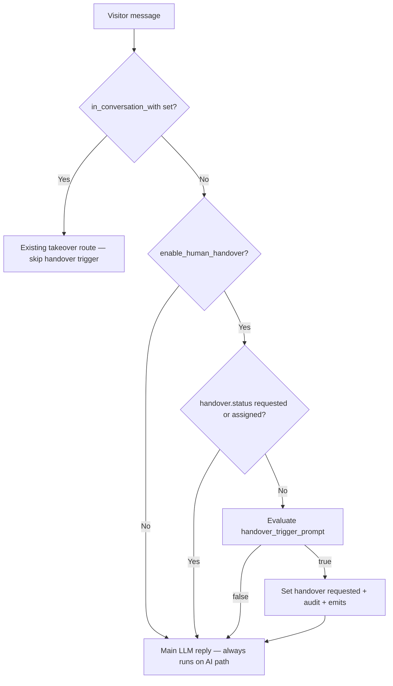

# Human handover — architecture plan

**Status:** Phase 1a (config CRUD APIs) implemented. Phase 1b (chat pipeline + visitor contact) implemented. Phase 1c (dashboard handover visibility + visitor takeover name emit) implemented.

**Goal:** When an agent has human handover enabled, the AI detects visitor intent to speak with a real person (via LLM, no widget button). The session is flagged for the team dashboard, the visitor is told their request was registered, a name/email contact form is shown, and a team member can manually take over using the existing takeover flow. While waiting, the AI continues to answer normally.

**Scope:** Atlas widget visitor ↔ AI agent chat (`chat_with_agent_v1` / `atlas-visitor-message`), persisted in `atlas_chat_sessions` / `atlas_chat_mesages`. Reuses existing human takeover (`in_conversation_with`, `atlas-team-member-start-conversation`). No push/email notifications, no visitor cancel, no auto-assignment in v1.

---

## Product decisions (locked)

| Decision | Choice |
| -------- | ------ |
| Visitor trigger | **LLM intent detection only** — no “Talk to a human” button or dedicated socket event |
| While waiting for a human | **AI keeps replying** — handover does not pause or block the chat LLM |
| Contact form | Shown **immediately** when handover is detected; server emits a widget event |
| Contact fields | **`name`** and **`email`** only (stored on `handover.contact`; **not** synced to lead collection) |
| Team pickup | **Manual only** — existing `atlas-team-member-start-conversation` |
| Visitor cancel handover | **Not in v1** |
| Notifications | **Dashboard/socket list updates only** — no email, push, or Slack |
| Session `status` values | **Unchanged** — `active` \| `in_conversation` \| `resolved`; handover state lives on embedded `handover` object |
| Audit events | `handover_requested`, `handover_contact_submitted`, `handover_assigned` — **no** `handover_cancelled` or `handover_expired` |

---

## Current state

| Piece | Location | Today |
| ----- | -------- | ----- |
| Human takeover | `atlas_team_member_chat_controllers.py`, `persist_in_conversation_with()` | Team member starts conversation → `in_conversation_with` set, AI bypassed |
| Session status | `config/atlas_chat_config.py`, `atlas_chat_sessions` | `active`, `in_conversation`, `resolved` |
| Dashboard session list | `format_chat_session_as_visitor_row()` | Shows `status`, `in_conversation_with`, lead preview — no handover fields |
| Lead collection trigger | `lead_collection_services.py` → `_evaluate_collection_trigger()` | LLM structured output pattern to copy |
| Agent config | `atlas_agents` | `lead_collection_config` exists; no `human_handover_config` |

**Gap:** Visitors cannot request a human through chat; team has no “needs human assistance” signal before someone proactively takes over.

---

## Per-agent config

Stored on `atlas_agents.human_handover_config`. Follow the same CRUD pattern as `lead_collection_config` (defaults in config module, merge on agent update, dedicated get/update/reset APIs in a later phase).

### Config schema

```json
{
  "enable_human_handover": false,
  "handover_trigger_prompt": "Detect when the visitor explicitly asks to speak with a human, real person, live agent, or representative, or expresses frustration that requires human help."
}
```

### Config reference

| Key | Type | Default | Notes |
| --- | ---- | ------- | ----- |
| `enable_human_handover` | `boolean` | `false` | Master toggle |
| `handover_trigger_prompt` | `string` | `""` | **Required** when enabled; owner-defined rule for when the LLM should flag handover (same length bounds as `collection_trigger_prompt`: 10–500 chars after trim) |

When `enable_human_handover: false`, handover logic does not run.

### Explicitly **not** in config (v1)

- Widget CTA / `show_handover_button`
- `min_messages_before_ask` — evaluate trigger on **every** visitor message while handover is not yet `requested` (can add later if needed)
- Auto-assignment, queue, or routing rules
- Custom waiting/offline copy (use fixed server messages in v1)
- Visitor cancel or expiry TTL

---

## Session handover state

Embedded object on `atlas_chat_sessions`. Initialized as `null` (or absent) for new sessions.

### Schema

```json
{
  "handover": {
    "status": "requested",
    "requested_at": "2026-07-26T18:05:12.340Z",
    "reason": "Visitor asked to speak with a sales representative about enterprise pricing.",
    "contact": {
      "name": null,
      "email": null
    },
    "assigned_to": null
  }
}
```

| Field | Type | Notes |
| ----- | ---- | ----- |
| `status` | `"requested"` \| `"assigned"` | `requested` = waiting for team pickup; `assigned` = linked to active takeover |
| `requested_at` | `datetime` (UTC) | Set when status becomes `requested` |
| `reason` | `string` \| `null` | From handover trigger LLM (`reason` field) |
| `contact.name` | `string` \| `null` | Filled when visitor submits contact form |
| `contact.email` | `string` \| `null` | Filled when visitor submits contact form; validate email format |
| `assigned_to` | `string` \| `null` | Team member `user_id` when takeover starts; mirrors `in_conversation_with` |

### State machine

```
(null / no handover)
    → requested     (LLM trigger fires once per session)
    → assigned      (team member starts takeover)

assigned persists until session resolve or takeover release clears handler
```

| Transition | When | Session `status` |
| ---------- | ---- | ---------------- |
| → `requested` | First time trigger LLM returns `should_request_handover: true` | Stays `active` (or current non-resolved status) |
| → `assigned` | `atlas-team-member-start-conversation` while `handover.status == requested` | Becomes `in_conversation` (existing takeover behavior) |
| Clear `assigned_to` | Takeover released or session resolved | `handover.status` may remain `assigned` with `assigned_to: null`, or reset handover — **recommend:** keep `assigned` history but set `assigned_to: null` on release; do **not** revert to `requested` |

**One-shot trigger:** Once `handover.status` is `requested` or `assigned`, do **not** re-run `handover_trigger_prompt` for that session.

**Reactivation:** If a resolved session is reactivated by a new visitor message, existing `handover` object is unchanged unless product later decides to clear it (v1: leave as-is on reactivate).

---

## When handover is detected

### Preconditions (all required)

1. `human_handover_config.enable_human_handover` is `true`
2. Session has no `handover` object, or `handover.status` is not yet set (first detection only)
3. Session is **not** in active human takeover (`in_conversation_with` is `null`)
4. Visitor message is on the **AI path** (not already routed to a human handler)

### Trigger evaluation

Mirror `lead_collection_services._evaluate_collection_trigger()`:

| Rule | Detail |
| ---- | ------ |
| When | On **every new visitor message** until `handover.status` is `requested` or `assigned` |
| Input | `handover_trigger_prompt` + full conversation history (visitor + agent messages) |
| Output | Structured: `{ "should_request_handover": bool, "reason": str }` |
| Model | Small/fast structured call via `openai_structured_output()` (new `HandoverTriggerResult` in `structured_output_models.py`) |
| Latency | Inline in `chat_with_agent_v1` before main LLM reply (same as lead trigger) |

### On `should_request_handover: true`

1. **Persist** `handover` on `atlas_chat_sessions` with `status: requested`, `requested_at`, `reason`, empty `contact`, `assigned_to: null`
2. **Audit** `handover_requested` (see [Audit events](#audit-events))
3. **Emit to visitor widget** `handover_requested` — payload includes `reason`, `waiting_message`, and `show_contact_form: true` (see [Socket events](#socket-events))
4. **Emit to dashboard** `chat_session_handover_updated` on room `agent_{agent_id}_members` — patch row for all online team members
5. **Main LLM** still runs and replies to the visitor’s current message (include optional system hint: acknowledge that a human has been notified and they may continue chatting while they wait)

Fixed visitor copy (v1, server-side):

> Your request to speak with a team member has been registered. Someone will join as soon as possible. You can keep chatting here in the meantime.

The AI reply should incorporate this acknowledgment; the socket event drives the contact form UI.

---

## Contact form

Shown when the widget receives `handover_requested` (`show_contact_form: true`). Fields: **name**, **email**.

### Submit

| Direction | Event / endpoint | Purpose |
| --------- | ---------------- | ------- |
| Client → server | `atlas-visitor-handover-contact` (socket) or HTTP `POST /elysium-atlas/handover/v1/submit-contact` | Persist `handover.contact` |
| Server → client | `handover_contact_saved` | Ack to visitor widget |
| Server → dashboard | `chat_session_handover_updated` | Refresh row with contact preview |

Validation:

- `email` — required format check (reuse lead collection email validator if available)
- `name` — non-empty after trim, reasonable max length
- Only accepted when `handover.status == requested` and session belongs to `agent_id` + `chat_session_id`

On success: audit `handover_contact_submitted` with metadata `{ "has_name": true, "has_email": true }` (do not log full PII in application logs).

If the visitor never submits the form, handover remains `requested` with null contact — team still sees the session flagged.

---

## Team dashboard

### Session list row extensions

Extend `format_chat_session_as_visitor_row()`:

| Field | Type | Notes |
| ----- | ---- | ----- |
| `handover_status` | `null` \| `"requested"` \| `"assigned"` | From `handover.status` |
| `handover_requested_at` | `string` \| `null` | ISO UTC for sorting/badge |
| `handover_reason` | `string` \| `null` | LLM reason preview |
| `handover_contact_name` | `string` \| `null` | List preview |
| `handover_contact_email` | `string` \| `null` | List preview |

### UI affordances (frontend)

- Badge on session row when `handover_status == "requested"` (e.g. “Human requested”)
- Filter or tab: sessions where `handover_status == "requested"`
- Optional sort boost: `handover_requested_at` desc among active sessions
- Session detail panel: reason, contact fields, time requested

### Pickup (unchanged flow)

Team member clicks **Start conversation** → existing `atlas-team-member-start-conversation`:

1. `persist_in_conversation_with()` — sets `in_conversation_with`, `status: in_conversation`
2. Update `handover.status` → `assigned`, `handover.assigned_to` → handler `user_id`
3. Audit `handover_assigned`
4. Existing emits: `conversation_started`, `chat_session_takeover_updated`

No separate “accept handover” API.

### While `handover.status == requested` and no takeover yet

- Visitor messages continue on the **AI path** (not routed to a human)
- Team can **monitor** the session (existing passive monitor) or **take over** when ready
- New visitor messages do **not** re-trigger handover evaluation

---

## Per-message pipeline



Handover trigger runs **before** the main LLM call. Lead collection trigger can run in the same turn; define order: **handover trigger first**, then lead trigger (handover takes precedence for emits; both may fire in one turn if both match — product accepts this edge case in v1).

---

## Socket events

### Visitor widget

| Direction | Event | When |
| --------- | ----- | ---- |
| Server → client | `handover_requested` | Trigger LLM fires; includes `chat_session_id`, `reason`, `waiting_message`, `show_contact_form: true` |
| Client → server | `atlas-visitor-handover-contact` | Visitor submits name + email |
| Server → client | `handover_contact_saved` | Contact persisted |

### Team dashboard

| Direction | Event | When |
| --------- | ----- | ---- |
| Server → client | `chat_session_handover_updated` | Handover requested, contact submitted, or handover assigned |

Payload shape (patch):

```json
{
  "chat_session_id": "web-c043-...",
  "handover_status": "requested",
  "handover_requested_at": "2026-07-26T18:05:12.340Z",
  "handover_reason": "Visitor asked to speak with a human.",
  "handover_contact_name": "Priya Sharma",
  "handover_contact_email": "priya@acme.in",
  "handover_assigned_to": null
}
```

Document in [live-visitor-chat.md](./live-visitor-chat.md) when implemented.

---

## Audit events

Add to `atlas_chat_session_audits` (see [chat-session-audit.md](./chat-session-audit.md)):

| `event_type` | When | `actor_type` | `metadata` |
| ------------ | ---- | ------------ | ---------- |
| `handover_requested` | `handover.status` set to `requested` | `system` | `{ "reason": "..." }` |
| `handover_contact_submitted` | Visitor submits contact form | `visitor` | `{ "has_name": true, "has_email": true }` |
| `handover_assigned` | Takeover starts while handover was `requested` | `team_member` | `{ "assigned_to": "user_id", "in_conversation_with": "user_id" }` |

**Not in v1:** `handover_cancelled`, `handover_expired`.

---

## Mongo indexes

Add to `services/mongo_indexes.py`:

| Collection | Index | Purpose |
| ---------- | ----- | ------- |
| `atlas_chat_sessions` | `(agent_id, handover.status, handover.requested_at desc)` | Dashboard filter “needs human” (partial index where `handover.status == "requested"`) |

Existing `(agent_id, status, last_message_at)` remains sufficient for mixed lists; handover filter is additive.

---

## Implementation plan

### Phase 1a — Config layer

| Task | File(s) | Status |
| ---- | ------- | ------ |
| `DEFAULT_HUMAN_HANDOVER_CONFIG`, validators | `config/human_handover_config.py` | Done |
| Pydantic request/response models | `config/human_handover_models.py` | Done |
| Default on agent init | `config/atlas_agent_config_data.py` → `human_handover_config` | Done |
| CRUD routes + controllers + services | `routes/elysium_atlas/human_handover_routes.py`, controllers, `human_handover_config_services.py` | Done |
| RBAC | Owner/admin update; member read (mirror lead collection) | Done |
| Agent create/update legacy path | `atlas_controllers.py`, `agent_services.py` | Done |
| Frontend API guide | `documentation/frontend-human-handover-api-guide.md` | Done |

### Phase 1b — Chat pipeline + session state

| Task | File(s) | Status |
| ---- | ------- | ------ |
| `HandoverTriggerResult` model | `config/structured_output_models.py` | Done |
| Runtime constants | `config/human_handover_constants.py` | Done |
| Trigger evaluation + contact persist | `services/elysium_atlas_services/human_handover_services.py` | Done |
| Wire trigger into chat flow (before main LLM) | `services/elysium_atlas_services/agent_chat_services.py` | Done |
| List row fields | `format_chat_session_as_visitor_row()` | Done |
| Visitor socket: contact submit/decline | `sockets.py` | Done |
| HTTP contact submit/decline | `human_handover_routes.py` | Done |
| Reconnect re-emit pending form | `atlas_visitor_socket_services.py` | Done |
| Audits | `atlas_chat_session_audit_services.py` | Done |

### Phase 1c — Dashboard + visitor takeover notification

| Task | File(s) | Status |
| ---- | ------- | ------ |
| `handover_requested_count` on summary poll | `get_agent_chat_sessions_summary()` | Done |
| Handover fields on `chat_session_takeover_updated` | `atlas_team_member_emit_services.py` | Done |
| On takeover: `handover` → `assigned`, audit `handover_assigned` | `assign_handover_on_takeover()`, `persist_in_conversation_with()` | Done |
| Visitor `conversation_started` with handler name + message | `emit_conversation_started()` | Done |
| Mongo index `(agent_id, handover.status)` | `mongo_indexes.py` | Done |
| Frontend guide updates | `frontend-human-handover-api-guide.md` | Done |

### Phase 2+ (out of scope)

| Feature | Notes |
| ------- | ----- |
| `min_messages_before_ask` gate | Reduce false positives on first message |
| Visitor cancel (“Continue with AI”) | Clear `handover` or set cancelled state |
| Request expiry / ARQ cleanup | Auto-clear stale `requested` |
| Email/push when `handover_requested` | Notify offline team |
| Auto-assign / round-robin | Routing layer |
| Custom waiting copy per agent | Config-driven messages |
| Dedicated handover queue API | Separate from session list |
| Integration with `atlas_support_tickets` | Ticket on handover + contact |

---

## Interaction with existing features

| Feature | Behavior in v1 |
| ------- | -------------- |
| **Lead collection** | **Fully separate.** Handover contact form writes only to `session.handover.contact` — never to `lead_collection` or `atlas_leads`. While `handover.status == requested`, lead collection pipeline is skipped for that turn. |
| **Human takeover** | On start: sets `handover.assigned_to` when status was `requested`. On **release** or **resolve**: clears active request fields only; **keeps** name/email if already captured |
| **Session resolve** | Clears `in_conversation_with`; handover object retained for history |
| **Session reactivate** | Visitor message after resolve; handover state unchanged |
| **Monitor mode** | Works during `handover.status == requested` (AI still replying) |

---

## Example flow

| Step | Visitor | System | Team |
| ---- | ------- | ------ | ---- |
| 1 | “What’s your refund policy?” | AI answers | — |
| 2 | “I need to talk to a real person.” | Trigger LLM → `should_request_handover: true` | — |
| 3 | — | `handover.status = requested`, audit, emit `handover_requested` + form | Row shows “Human requested” |
| 4 | — | AI replies: acknowledges human notified + answers if needed | — |
| 5 | Submits name + email in form | `handover.contact` saved, audit, dashboard patch | Sees contact on row |
| 6 | “Are you still there?” | AI replies (still on AI path) | Member monitors or takes over |
| 7 | — | Member starts conversation | `handover.assigned_to` set, `in_conversation_with` set |
| 8 | “Hi, I’m Alex…” | Routed to human (existing takeover path) | Handler chats |

---

## Open questions (resolve during implementation)

| # | Question | Recommendation |
| - | -------- | -------------- |
| 1 | Handover + lead trigger same message? | Run handover first; both may fire; AI prompt mentions handover acknowledgment only when handover just fired |
| 2 | After takeover release, revert `handover.status`? | **Reset active request** (`status`, `reason`, `assigned_to` cleared). **Preserve** `contact` + `contact_status` when visitor already submitted or declined |
| 3 | Clear `handover` on session resolve? | Keep embedded object for history; dashboard hides badge when resolved |
| 4 | HTTP fallback for contact form? | Add REST endpoint alongside socket for non-socket clients |
| 5 | `handover_trigger_prompt` empty when enabled? | Reject on config save (same as lead collection) |

---

## Related docs

- [Live visitor chat](./live-visitor-chat.md) — session list, takeover, socket events
- [Chat session audit](./chat-session-audit.md) — lifecycle audit schema
- [Lead collection plan](./lead-collection-plan.md) — trigger LLM pattern to mirror
