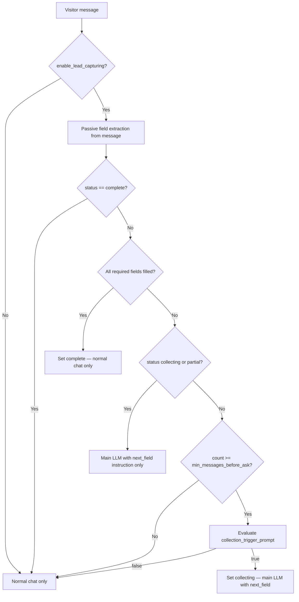

# Lead collection — architecture plan

**Status:** Phase 1a (config CRUD APIs) implemented. Phase 1b (chat pipeline) not yet implemented.

**Goal:** Let agent owners and admins configure **per-agent** when and which contact fields to collect during live visitor chat. Team **members** can view rules but not change them. The AI answers normally until a trigger rule fires, then asks for missing fields one at a time. Once all required fields are captured, lead logic is removed from the LLM for the rest of the session.

**Scope:** Atlas widget visitor ↔ AI agent chat (`chat_with_agent_v1`), persisted in `atlas_chat_sessions` / `atlas_chat_mesages`. Human takeover paths are out of scope for proactive collection triggers in Phase 1.

---

## Current state (scaffolding only)

| Piece | Location | Today |
| ----- | -------- | ----- |
| Agent config toggle | `config/lead_collection_config.py` | Only `enable_lead_capturing: false` |
| Agent create/update | `atlas_controllers.py`, `agent_services.py` | Validates and stores `lead_collection_config` |
| Structured extraction model | `config/structured_output_models.py` | Fixed `LeadExtraction` (name, email, phone, description) — not wired into chat |
| Chat pipeline | `services/elysium_atlas_services/agent_chat_services.py` | No lead collection logic |

---

## Phase 1 — user-configurable settings

Stored on `atlas_agents.lead_collection_config`.

### Config schema

```json
{
  "enable_lead_capturing": true,
  "collection_trigger_prompt": "Start collecting contact details when the visitor asks about pricing, wants a demo or quote, requests a callback, or needs help that requires a human follow-up.",
  "min_messages_before_ask": 2,
  "fields": [
    { "key": "email", "required": true, "order": 1 },
    { "key": "name", "required": true, "order": 2 },
    { "key": "phone", "required": false, "order": 3 }
  ]
}
```

### Config reference

| Key | Type | Default | Notes |
| --- | ---- | ------- | ----- |
| `enable_lead_capturing` | `boolean` | `false` | Master toggle |
| `collection_trigger_prompt` | `string` | — | **Required** when enabled; 10–500 chars after trim |
| `min_messages_before_ask` | `integer` | `2` | Minimum **visitor** messages before trigger evaluation; ≥ 1 |
| `fields` | `array` | `[]` | At least one field when enabled |
| `fields[].key` | `string` | — | Built-in key (see below) |
| `fields[].required` | `boolean` | `false` | All required fields must be present for `complete` status |
| `fields[].order` | `integer` | — | Proactive ask order; unique per config |

### Built-in field keys (Phase 1)

| Key | Description |
| --- | ----------- |
| `email` | Email address |
| `name` | Full name |
| `phone` | Phone number (normalized server-side, e.g. E.164 where possible) |
| `company` | Company / organization |
| `interest` | What the visitor wants — auto-summarized from conversation when possible |

Custom fields are **not** in Phase 1.

### Validation rules

When `enable_lead_capturing: true`:

- `collection_trigger_prompt` must be present and 10–500 chars after trim.
- `fields` must contain at least one entry.
- Each `fields[].key` must be from the built-in set.
- Each `fields[].order` must be unique.
- `min_messages_before_ask` must be an integer ≥ 1.

When `enable_lead_capturing: false`:

- Other keys are ignored; no lead logic runs.

### Explicitly **not** in config (decided)

These were considered and removed — do not implement:

- `on_intent` / `intent_phrases` — replaced by `collection_trigger_prompt`
- `on_session_end` — no special end-of-session proactive asks
- `on_human_takeover` — no takeover-triggered collection in Phase 1
- `on_widget_cta` — no CTA-triggered collection in Phase 1

---

## When collection starts

Two conditions, both required:

1. `visitor_message_count >= min_messages_before_ask` (visitor messages only; agent replies do not count).
2. A lightweight LLM call evaluates `collection_trigger_prompt` against the **full conversation so far** and returns `should_collect: true`.

### Trigger evaluation rules

| Rule | Detail |
| ---- | ------ |
| Gate | No trigger evaluation until visitor message count reaches `min_messages_before_ask` |
| Re-evaluation | From the gate onward, evaluate on **every new visitor message** until the session enters `collecting` |
| Late intent | If messages 1–4 are FAQ and message 5 matches the trigger, collection starts on message 5 |
| One-shot trigger | Once `collecting`, do **not** re-run `collection_trigger_prompt` for that session |
| Complete session | Once `complete`, skip trigger evaluation entirely |

### Trigger LLM input / output

**Input:**

- `collection_trigger_prompt` (owner rule)
- Full chat history (visitor + agent messages)

**Output (structured):**

```json
{
  "should_collect": true,
  "reason": "Visitor asked about pricing for 500 agents"
}
```

Run this as a small, fast structured call (reuse patterns from `extract_structured_data_controller`). Cache `should_collect: true` on the session so later messages skip re-evaluation.

---

## Per-message pipeline



### Passive extraction

- Runs on **every** visitor message while `enable_lead_capturing` is true, even before `min_messages_before_ask`.
- Extracts any volunteered field values (email in text, name, phone, etc.).
- Does **not** cause proactive asks before the trigger fires.
- Merges into session lead state; never overwrites a captured value unless the visitor explicitly corrects it (optional Phase 1 enhancement).

### Proactive collection

- Starts only after trigger fires (`collecting`).
- Ask **one field per turn**, in `fields[].order`.
- Skip fields already captured (passively or proactively).
- AI must **answer the visitor's question first**, then ask for the next missing field in the same reply.

### When lead is complete

Once all `required: true` fields are captured:

1. Set session lead status to `complete`.
2. Persist final lead document.
3. **Remove all lead-collection context from the main chat LLM** for subsequent messages:
   - No `collection_trigger_prompt`
   - No “ask for email / name / phone” instructions
   - No trigger evaluation
4. Chat continues as a normal agent conversation.

Server-side storage and dashboard badges still reflect the captured lead; the LLM simply does not see or act on lead logic anymore.

---

## Session lead state

Stored on `atlas_chat_sessions` (embedded `lead_collection` object) and mirrored in `atlas_leads`.

### State machine

| Status | Meaning |
| ------ | ------- |
| `not_started` | No trigger yet; passive extraction may have captured fields |
| `collecting` | Trigger fired; proactively asking for missing fields |
| `partial` | Some but not all required fields captured |
| `complete` | All required fields captured |

Transitions:

```
not_started → collecting   (trigger fires)
collecting  → partial      (some fields captured, required still missing)
partial     → complete     (all required fields captured)
collecting  → complete     (all required captured in one turn — possible if passive extraction filled everything)
```

### Example session document fragment

```json
{
  "chat_session_id": "web-c043-...",
  "agent_id": "695c342989c5797e0f344572",
  "lead_collection": {
    "status": "collecting",
    "triggered_at_message": 5,
    "trigger_reason": "Visitor asked about pricing for 500 agents",
    "fields": {
      "email": "priya@acme.in",
      "name": null,
      "phone": null,
      "company": null,
      "interest": "Enterprise deployment for 500 agents"
    },
    "next_field": "name",
    "completed_at": null
  }
}
```

---

## Data model — `atlas_leads` (new collection)

One lead document per chat session (upsert on `chat_session_id` + `agent_id`).

| Field | Type | Notes |
| ----- | ---- | ----- |
| `lead_id` | `string` | UUID |
| `agent_id` | `string` | Agent scope |
| `chat_session_id` | `string` | Source session |
| `team_id` | `string` | From agent / JWT context |
| `status` | `string` | `partial` \| `complete` |
| `fields` | `object` | Captured values keyed by field `key` |
| `trigger_reason` | `string` | From trigger LLM |
| `triggered_at_message` | `integer` | Visitor message number when collection started |
| `created_at` | `datetime` | First field captured |
| `completed_at` | `datetime` | When status became `complete`; null if partial |

### Mongo indexes

- `(agent_id, chat_session_id)` — unique
- `(agent_id, status, completed_at desc)` — dashboard list
- `(agent_id, fields.email)` — optional dedupe / search

### Chat session list UI (Phase 1)

Extend chat session row shape with:

| Field | Notes |
| ----- | ----- |
| `lead_status` | `null` \| `partial` \| `complete` |
| `lead_email` | First captured email, if any (for list preview) |
| `lead_name` | First captured name, if any |

---

## LLM integration

### 1. Trigger classifier (separate small call)

- Runs only when: enabled, not `complete`, not already `collecting`/`partial`, and `count >= min_messages_before_ask`.
- Does not run once `collecting` has started or lead is `complete`.

### 2. Passive extraction (separate small call or combined)

- Build dynamic schema from configured `fields` keys.
- Extend / replace fixed `LeadExtraction` in `structured_output_models.py` with agent-config-driven extraction.
- Input: latest visitor message + recent context; output: partial field map.

### 3. Main chat LLM prompt injection

| Session state | Inject into main prompt? |
| ------------- | ------------------------ |
| `not_started` (pre-trigger) | **No** lead instructions |
| `collecting` / `partial` | **Yes** — only: captured fields, `next_field`, one-line rule (“answer the question, then ask for `{next_field}` if still missing”) |
| `complete` | **No** — zero lead content |

**Critical:** After `complete`, the main LLM must not receive `collection_trigger_prompt` or any lead-collection system text.

---

## Conversation UX rules

1. Never ask for contact info on the first message when below `min_messages_before_ask`.
2. Always answer the visitor's question before asking for a field.
3. Ask one field per turn, in configured `order`.
4. Never re-ask a field already captured.
5. Briefly confirm captured values (“I've noted …”) before asking the next field.
6. If the visitor refuses a non-required field (e.g. phone), continue without blocking the chat.
7. After all required fields are captured, thank the visitor and return to normal help — no further lead prompts.

### Example flow (`min_messages_before_ask: 3`, fields: email → name → phone)

| Msg | Visitor | System | AI behavior |
| --- | ------- | ------ | ----------- |
| 1 | Shopify integration? | count=1, no trigger | Help only |
| 2 | Setup time? | count=2, no trigger | Help only |
| 3 | Supported models? | count=3, trigger **false** | Help only |
| 4 | Own knowledge base? | count=4, trigger **false** | Help only |
| 5 | 500 agents — pricing? | count=5, trigger **true** → `collecting` | Answer + ask **email** |
| 6 | priya@acme.in | email captured | Confirm + ask **name** |
| 7 | Priya Sharma | name captured | Confirm + ask **phone** |
| 8 | +91 98765 43210 | `complete` | Confirm + handoff; lead logic off |
| 9 | How to add team members? | `complete` — no lead prompt | Normal help only |

---

## Implementation plan (Phase 1)

### 1. Config layer

| Task | File(s) | Status |
| ---- | ------- | ------ |
| Extend `DEFAULT_LEAD_COLLECTION_CONFIG` with new keys | `config/lead_collection_config.py` | Done |
| Add field-key constants and validators | `config/lead_collection_config.py` | Done |
| Pydantic request models | `config/lead_collection_models.py` | Done |
| Dedicated CRUD routes + controllers + services | `routes/elysium_atlas/lead_collection_routes.py`, `controllers/.../lead_collection_controllers.py`, `services/.../lead_collection_config_services.py` | Done |
| Frontend API guide | `documentation/frontend-lead-collection-api-guide.md` | Done |
| Update agent create/update API guide | `documentation/frontend-agent-create-update-api-guide.md` | Done |

### 2. Services

| Task | File(s) |
| ---- | ------- |
| Lead collection state read/write on session | `services/elysium_atlas_services/atlas_chat_session_services.py` |
| Trigger evaluation service | `services/elysium_atlas_services/lead_collection_services.py` (new) |
| Passive field extraction (dynamic schema from config) | `services/elysium_atlas_services/lead_collection_services.py` |
| Lead upsert to `atlas_leads` | `services/elysium_atlas_services/lead_collection_services.py` |
| Build lead prompt block for main LLM (`next_field` only) | `services/elysium_atlas_services/lead_collection_services.py` |
| Wire pipeline into chat flow | `services/elysium_atlas_services/agent_chat_services.py` |

### 3. Data

| Task | File(s) |
| ---- | ------- |
| `atlas_leads` indexes | `services/mongo_indexes.py` |
| Include `lead_status` / preview fields in session list rows | `services/elysium_atlas_services/atlas_chat_session_services.py` |

### 4. Structured output

| Task | File(s) |
| ---- | ------- |
| Dynamic lead field extraction model builder | `config/structured_output_models.py` or `lead_collection_services.py` |
| Trigger classifier output model | `config/structured_output_models.py` |

### 5. Jobs (optional Phase 1)

Passive extraction and trigger checks are fast enough to run inline in `chat_with_agent_v1`. If latency becomes an issue, move trigger + extraction to a post-store ARQ job and inject lead ask on the **next** turn — not recommended for Phase 1.

---

## API / frontend

### Dedicated config CRUD (Phase 1a — implemented)

See **[frontend-lead-collection-api-guide.md](./frontend-lead-collection-api-guide.md)**.

| Endpoint | Purpose |
| -------- | ------- |
| `POST /elysium-atlas/lead-collection/v1/get-config` | Read config for `agent_id` |
| `POST /elysium-atlas/lead-collection/v1/update-config` | Partial merge update |
| `POST /elysium-atlas/lead-collection/v1/reset-config` | Reset to defaults |
| `POST /elysium-atlas/lead-collection/v1/get-field-catalog` | Built-in field metadata |

**RBAC:** Config is **agent-level**. **Owner** and **admin** may `update-config` / `reset-config`. **Member** may only `get-config` and `get-field-catalog` (view). Enforced via `can_user_modify_agent` / `can_user_read_agent` in `lead_collection_controllers.py`.

### Agent create / update (legacy path)

`lead_collection_config` partial merge on update (existing pattern). Example:

```json
{
  "lead_collection_config": {
    "enable_lead_capturing": true,
    "collection_trigger_prompt": "Start when the visitor asks about pricing, demos, or enterprise scale.",
    "min_messages_before_ask": 3,
    "fields": [
      { "key": "email", "required": true, "order": 1 },
      { "key": "name", "required": true, "order": 2 },
      { "key": "phone", "required": true, "order": 3 }
    ]
  }
}
```

### Dashboard

- Agent settings: toggle, trigger prompt textarea, min messages number input, field picker (built-in keys + required + order).
- Chat sessions list: badge `Lead` / `Partial lead` + optional email/name preview.
- Session detail: lead panel showing captured fields and status.

### Leads list API (optional Phase 1)

Dedicated `GET /leads` endpoint can slip to Phase 1.5; session row badges may suffice initially.

---

## Phase 2+ (out of scope)

| Feature | Notes |
| ------- | ----- |
| Custom fields | `select`, `text`, `number`, owner-defined keys |
| Preset templates | “SaaS demo”, “Local service”, etc. |
| Per-field ask prompts | Owner-written “ask for email” copy |
| Webhooks / CRM export | On `complete` |
| Dedicated leads dashboard | Filter, export CSV |
| Lead scoring | Intent strength + field completeness |
| Field correction handling | Visitor updates email mid-session after `complete` |

---

## Open questions (resolve during implementation)

| # | Question | Recommendation |
| - | -------- | -------------- |
| 1 | Count partial leads when visitor leaves before required fields? | Save `partial` in `atlas_leads` if any field captured; no proactive ask on disconnect |
| 2 | Required field `phone` refused? | Stay `partial`; do not block chat |
| 3 | Duplicate email across sessions? | Allow multiple leads per email in Phase 1; dedupe in Phase 2 |
| 4 | Human takeover while collecting? | Phase 1: pause AI collection prompts during takeover; resume if handed back to AI and still incomplete |
| 5 | Stream vs non-stream chat paths? | Both paths in `chat_with_agent_v1` must run the same lead pipeline |

---

## Related docs

- [Live visitor chat](./live-visitor-chat.md) — chat sessions, socket events, session list
- [Frontend agent create/update API guide](./frontend-agent-create-update-api-guide.md) — `lead_collection_config` today (toggle only)
