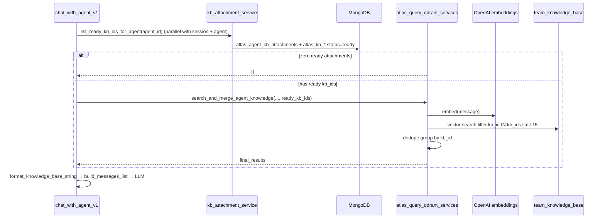

# Team KB retrieval — agent chat RAG

**Status:** Implemented (simple mode only).

**Related:** [team-knowledge-bases-plan.md](./team-knowledge-bases-plan.md)

---

## Overview

At chat time, the agent resolves **ready** knowledge items attached via `atlas_agent_kb_attachments`, embeds the user message, and searches **`team_knowledge_base`** in Qdrant with `kb_id IN (...)`. Top chunks are grouped per item and injected into the LLM prompt.

**Not in scope yet:** two-stage routing via `kb_item_catalog`, Redis caching of attachment lists.

---

## Entry points

Both paths call the same service layer:

| Entry | Route / event | Handler |
| ----- | ------------- | ------- |
| Visitor widget (streaming) | Socket `atlas-visitor-message` | `chat_with_agent_controller_v1` → `chat_with_agent_v1` |
| Team test chat (HTTP) | `POST /elysium-agents/elysium-atlas/v1/query-agent` | same controller (no `sid`, no stream) |

Retrieval is invoked from `chat_with_agent_v1` via `search_and_merge_agent_knowledge`.

---

## Retrieval pipeline



### Step 0 — Resolve attachments (parallel with session + agent load)

1. In parallel with chat session and agent config fetch, read `atlas_agent_kb_attachments` for `agent_id`.
2. For each `(kb_id, source_type)`, load the item from the matching `atlas_kb_*` collection.
3. Keep only items with `status: "ready"`.
4. If the list is empty → return `[]` (agent chats with **no** KB context; no error).

### Step 1 — Embed query

Single OpenAI embedding call on the user message (`text-embedding-3-small`, 1536 dims).

### Step 2 — Qdrant search

- **Collection:** `team_knowledge_base`
- **Filter:** `kb_id` match any of the ready attachment IDs
- **Limit:** 15 chunk hits (global top‑K across all attached items, not per item)

### Step 3 — Post-process

1. **Dedupe** by `(kb_id, text_index)` — keep highest score.
2. **Group** by `kb_id` — merge chunk texts in `text_index` order with `[Chunk N]` labels.
3. **Sort** groups by max chunk score (descending).

### Step 4 — Prompt injection

`format_knowledge_base_string(final_results)` builds the KB block. `build_messages_list` inserts it as a synthetic user message before the real user question.

---

## `retrieval_strategy` on agents

| Value | Current behavior |
| ----- | ---------------- |
| `simple` | Single-pass chunk search (described above) |
| `orchestrated` | **Same as simple** until catalog routing is built |

No warning is emitted when `orchestrated` is set; both strategies share the simple path.

---

## Qdrant chunk payload (what we read)

Each point in `team_knowledge_base`:

| Field | Example |
| ----- | ------- |
| `kb_id` | `"675a1f2b3c4d5e6f7a8b9c0d"` |
| `team_id` | team ObjectId string |
| `source_type` | `url` \| `file` \| `custom_text` \| `qa_pair` |
| `knowledge_source` | URL, S3 file key, or alias (display label) |
| `text_index` | `0`, `1`, `2`, … |
| `text_content` | chunk text |
| `knowledge_type` | `web_content`, `file_content`, `custom_text`, `qa_pair` |

`knowledge_source` by item type at index time:

| `source_type` | `knowledge_source` value |
| ------------- | ------------------------ |
| `url` | Normalized URL |
| `file` | S3 `file_key` |
| `custom_text` | `custom_text_alias` |
| `qa_pair` | `qna_alias` |

---

## Example: 8 attached items, user asks one question

**Attached (all `ready`):**

| kb_id | source_type | knowledge_source |
| ----- | ----------- | ---------------- |
| `u1` | url | `https://acme.com/pricing` |
| `u2` | url | `https://acme.com/faq` |
| `f1` | file | `teams/…/handbook.pdf` |
| `f2` | file | `teams/…/policy.docx` |
| `t1` | custom_text | `return_policy` |
| `t2` | custom_text | `shipping_info` |
| `q1` | qa_pair | `hours_faq` |
| `q2` | qa_pair | `warranty_faq` |

**User message:** `"What is your return policy and pricing?"`

Qdrant returns up to **15 chunks** globally — e.g. 4 from `t1`, 3 from `u1`, 2 from `f1`, 1 each from `q1`, `u2`, `f2` (other items may score too low to appear).

**`final_results` after grouping (3 items that had hits):**

```json
[
  {
    "kb_id": "t1",
    "knowledge_source": "return_policy",
    "source_type": "custom_text",
    "knowledge_type": "custom_text",
    "score": 0.91,
    "text_content": "[Chunk 0]\nReturns accepted within 30 days...\n\n[Chunk 1]\n..."
  },
  {
    "kb_id": "u1",
    "knowledge_source": "https://acme.com/pricing",
    "source_type": "url",
    "knowledge_type": "web_content",
    "score": 0.87,
    "text_content": "[Chunk 2]\nPro plan $49/mo..."
  },
  {
    "kb_id": "f1",
    "knowledge_source": "teams/acme/kb_items/f1/files/handbook.pdf",
    "source_type": "file",
    "knowledge_type": "file_content",
    "score": 0.82,
    "text_content": "[Chunk 0]\nEmployee handbook section 4..."
  }
]
```

**What the LLM sees** (KB user message body):

```text
The following information is provided as a Knowledge Base that may help you answer the user's question.

Guidelines:
- Use this Knowledge Base when it is relevant or helpful
- If the Knowledge Base contains useful information, incorporate it naturally into your response

Knowledge Base:

[knowledge_source: return_policy] source_type: "custom_text"

[Chunk 0]
Returns accepted within 30 days with receipt...

[Chunk 1]
Refunds processed within 5–7 business days...

###

[knowledge_source: https://acme.com/pricing] source_type: "url"

[Chunk 2]
Pro plan $49/mo, Enterprise contact sales...

###

[knowledge_source: teams/acme/kb_items/f1/files/handbook.pdf] source_type: "file"

[Chunk 0]
Employee handbook section 4 — pricing overview...
```

Sections are separated by `###`. Order follows relevance score (highest first). Items with no matching chunks in the top 15 do not appear.

---

## Code map

| Module | Role |
| ------ | ---- |
| `services/elysium_atlas_services/kb_item/kb_attachment_service.py` | `list_ready_kb_ids_for_agent` |
| `services/elysium_atlas_services/atlas_query_qdrant_services.py` | Qdrant search, dedupe, merge |
| `services/elysium_atlas_services/agent_chat_services.py` | `format_knowledge_base_string`, LLM message build |
| `config/kb_item_constants.py` | Collection names, `KB_STATUS_READY` |

---

## Future work

### Performance / latency (planned)

| Item | Status | Notes |
| ---- | ------ | ----- |
| Reuse Qdrant `AsyncQdrantClient` for search | **Done** | `search_qdrant_collection` uses startup singleton instead of per-request httpx |
| Parallel load session + agent + ready kb_ids | **Done** | `chat_with_agent_v1` gathers before RAG; passes `ready_kb_ids` into retrieval |
| Redis cache plan limits | Planned | Cache `atlas_user_available_plan_limits` per owner; invalidate on plan change / query decrement |
| KB context token cap | Planned | Trim top chunks or max chars before LLM when prompt latency is too high |
| Redis cache ready `kb_ids` | Planned | Cache per `agent_id`; invalidate on attach, detach, item delete, status change |

### Orchestrated (two-stage) retrieval

When implemented, `orchestrated` will:

1. Search `kb_item_catalog` with `kb_id IN (attached)` → top items.
2. Search `team_knowledge_base` with `kb_id IN (top items)` → chunks.

`simple` remains the default single-pass path.

---

## Operational notes

- Attachments pointing to `draft`, `indexing`, or `failed` items are ignored at retrieval time.
- Detaching an item takes effect on the next message (no cache delay today).
- Deleting a KB item removes Qdrant points and attachment rows; retrieval scope shrinks automatically.
