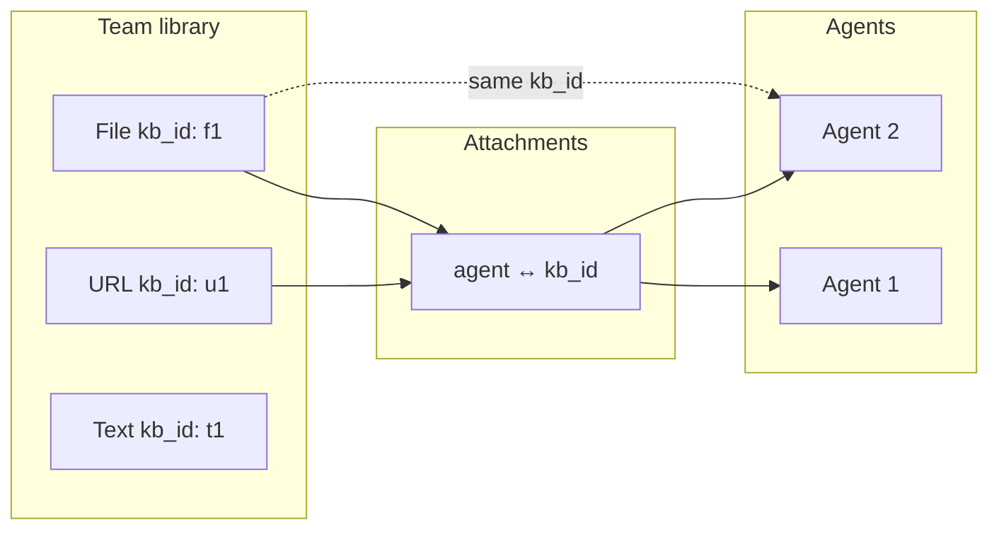
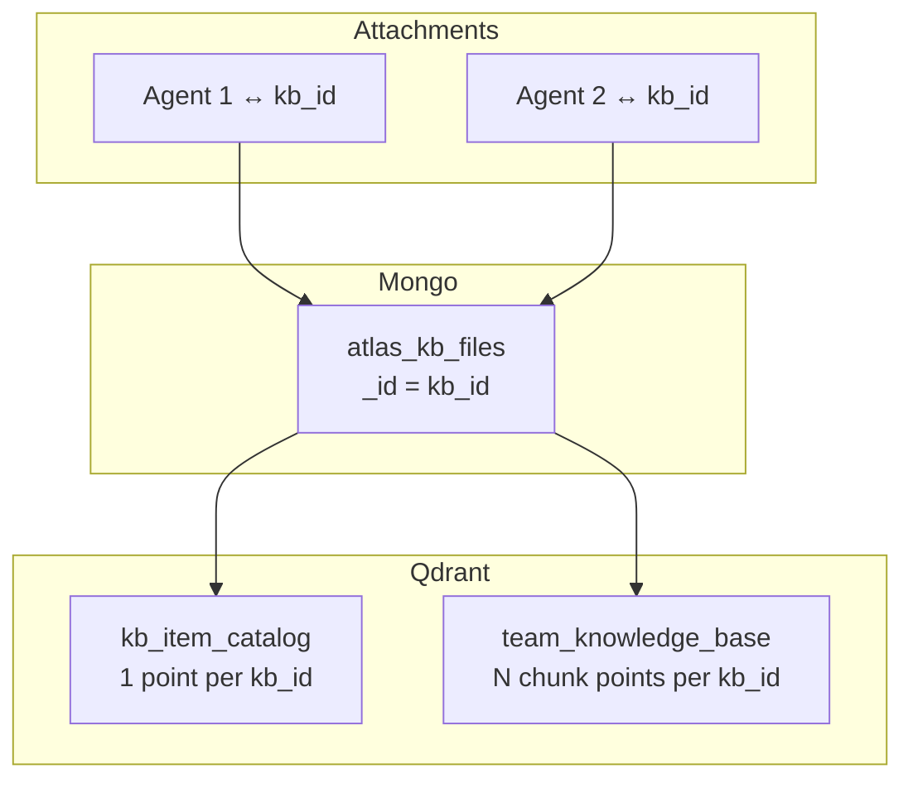
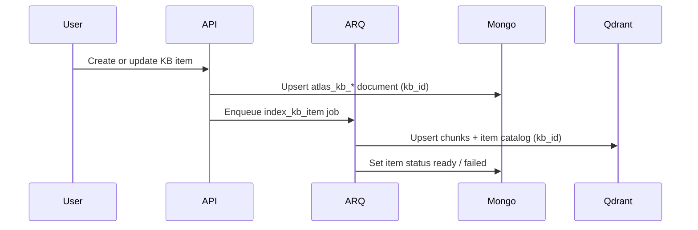

# Team-scoped knowledge items — architecture plan

**Status:** Planning only — implementation details and timeline TBD.

**Goal:** Decouple knowledge from individual agents. A team creates and indexes each knowledge item (URL, file, custom text, Q&A) once under its own `kb_id`; multiple agents attach that `kb_id` by reference instead of re-indexing the same content per agent.

**Legacy data:** Not in scope. Existing Mongo and Qdrant KB data has been cleared; we can design the new model without migration paths.

---

## Problem with the current model

Today, every knowledge source is owned by a single `agent_id`:

| Layer | Collections / storage | Ownership key |
|-------|----------------------|---------------|
| Mongo metadata | `atlas_agent_urls`, `atlas_agent_files`, `atlas_custom_texts`, `atlas_qa_pairs` | `agent_id` |
| Qdrant chunks | `agent_knowledge_base` | `agent_id` + `knowledge_source` |
| Qdrant item summaries | `agent_web_catalog` | `agent_id` + `url` (URL-only; dropped in new model) |
| S3 | Paths under `agents/{agent_id}/...` | `agent_id` |

Consequences:

- Uploading the same PDF to two agents indexes it twice (embeddings, Mongo rows, S3 copies).
- Updating an agent's knowledge re-runs indexing even when the underlying content is unchanged.
- There is no team-level reusable knowledge library.

---

## Target model (high level)



**Core ideas:**

1. **`kb_id` = one knowledge item** — each URL, file, custom text, or Q&A pair is its own indexed unit. Document `_id` in the source collection **is** the `kb_id`. There is **no** parent `atlas_knowledge_bases` shell collection.
2. **Team-scoped items** — every item document carries `team_id` for RBAC and listing.
3. **Agents attach `kb_id`s via a junction collection** — many-to-many between agents and items; **do not** store `kb_ids` on `atlas_agents` (unlike `tool_ids`).
4. **Index once per item** — embedding runs when the item is created or updated, not when an agent attaches it.
5. **Query by union** — at chat/retrieval time, resolve attached `kb_id`s for the agent, then search Qdrant with `kb_id IN (...)`.

**Sharing:** One file with `kb_id = f1` attached to three agents = **one** Mongo row, **one** Qdrant index, **three** rows in `atlas_agent_kb_attachments`.

---

## Proposed data model

### 1. Mongo — collections (decided)

**No `atlas_knowledge_bases`.** Five collections total: four item stores + one attachment junction.

| Collection | Role |
|------------|------|
| `atlas_kb_urls` | One document per URL item; `_id` = `kb_id` |
| `atlas_kb_files` | One document per file item; `_id` = `kb_id` |
| `atlas_kb_custom_texts` | One document per custom text item; `_id` = `kb_id` |
| `atlas_kb_qa_pairs` | One document per Q&A item; `_id` = `kb_id` |
| `atlas_agent_kb_attachments` | Which `kb_id`s are attached to which agents |

Module-level constants:

```python
KB_URLS_COLLECTION = "atlas_kb_urls"
KB_FILES_COLLECTION = "atlas_kb_files"
KB_CUSTOM_TEXTS_COLLECTION = "atlas_kb_custom_texts"
KB_QA_PAIRS_COLLECTION = "atlas_kb_qa_pairs"
AGENT_KB_ATTACHMENTS_COLLECTION = "atlas_agent_kb_attachments"
```

#### Item collections (`atlas_kb_*`)

Each document is a **standalone knowledge item**. Legacy agent-scoped collections map as follows:

| Legacy (agent-scoped) | New (item-scoped) |
|-----------------------|-------------------|
| `atlas_agent_urls` | `atlas_kb_urls` |
| `atlas_agent_files` | `atlas_kb_files` |
| `atlas_custom_texts` | `atlas_kb_custom_texts` |
| `atlas_qa_pairs` | `atlas_kb_qa_pairs` |

**Common fields on every item document:**

| Field | Purpose |
|-------|---------|
| `_id` | `kb_id` (ObjectId string) |
| `team_id` | Owning team — required for RBAC and team library APIs |
| `status` | `draft` \| `indexing` \| `ready` \| `failed` — per-item indexing state |
| `created_by_user_id` | Audit |
| `created_at` / `updated_at` | Timestamps |

Plus type-specific fields (e.g. `url`, `file_key`, `custom_text_alias`, `qna_alias`, question/answer text, etc.) — largely the same as today, minus `agent_id`.

**Resolving a `kb_id`:** globally unique `_id`; use `source_type` on the attachment row (or a team index/registry later) to know which of the four collections to read.

#### Agent ↔ KB attachments (`atlas_agent_kb_attachments`)

Junction collection for many-to-many agent ↔ item links.

**Example document:**

```json
{
  "_id": "679...",
  "agent_id": "674...",
  "kb_id": "675...",
  "team_id": "673...",
  "source_type": "file",
  "attached_by_user_id": "672...",
  "attached_at": "2026-06-24T10:00:00Z"
}
```

| Field | Purpose |
|-------|---------|
| `agent_id` | Agent receiving the knowledge item |
| `kb_id` | Item `_id` in one of the `atlas_kb_*` collections |
| `team_id` | Denormalized — must match both agent and item `team_id` |
| `source_type` | `url` \| `file` \| `custom_text` \| `qa_pair` — avoids scanning all four collections on read |
| `attached_by_user_id` / `attached_at` | Audit |

**Indexes:**

- Unique compound: `(agent_id, kb_id)` — one attachment per pair
- `(agent_id, attached_at)` — list items attached to an agent
- `(kb_id)` — find all agents using an item (delete / impact analysis)
- `(team_id, agent_id)` — team-scoped agent attachment queries

**Attach validation:**

1. Agent exists and caller has access.
2. Item exists in the collection implied by `source_type`.
3. Item `team_id` == agent `team_id`.
4. Upsert attachment row; **no re-index** on attach.

**Detach:** delete attachment row only; item and Qdrant data remain for other agents.

**`atlas_agents`:** unchanged for knowledge — no `kb_ids` array on the agent document.

### 2. Qdrant — collections (decided)

Two team-wide collections. **No `agent_id` on any point** — agent scope is resolved at query time via `atlas_agent_kb_attachments` → `kb_id IN (...)`.

Drop legacy collections: `agent_knowledge_base`, `agent_web_catalog` (no backfill).

| Collection | Role | Granularity | Vector source |
|------------|------|-------------|---------------|
| `team_knowledge_base` | Chunk store (replaces `agent_knowledge_base`) | Many points per item | `text_content` |
| `kb_item_catalog` | Item summaries for routing (replaces `agent_web_catalog`) | **Exactly 1 point per `kb_id`** | `summary` |

Embedding: `text-embedding-3-small`, dimension **1536**, distance **cosine** (same as today).

Module-level constants:

```python
TEAM_KNOWLEDGE_BASE_COLLECTION = "team_knowledge_base"
KB_ITEM_CATALOG_COLLECTION = "kb_item_catalog"
EMBEDDING_DIM = 1536
EMBEDDING_MODEL = "text-embedding-3-small"
```



**Sharing:** one file (`kb_id = f1`) attached to two agents → **one** catalog point + **one** chunk set in Qdrant; attach/detach only changes Mongo.

#### `team_knowledge_base` — chunks

**Point ID:** deterministic for idempotent re-index: `{kb_id}::chunk::{text_index}`

**Example point:**

```json
{
  "id": "675a1f...::chunk::0",
  "vector": [1536 floats],
  "payload": {
    "kb_id": "675a1f2b3c4d5e6f7a8b9c0d",
    "team_id": "673...",
    "source_type": "file",
    "knowledge_source": "teams/acme/kb_items/675a.../files/handbook.pdf",
    "text_index": 0,
    "text_content": "Leave policy: full-time employees receive...",
    "knowledge_type": "file_content",
    "created_at": "2026-06-24T10:00:00Z"
  }
}
```

| Payload field | Required | Notes |
|---------------|----------|-------|
| `kb_id` | yes | Primary filter key — matches Mongo item `_id` |
| `team_id` | yes | Bulk delete / admin; not used in normal agent retrieval |
| `source_type` | yes | `url` \| `file` \| `custom_text` \| `qa_pair` |
| `knowledge_source` | yes | URL, S3 key, or alias — display and debug |
| `text_index` | yes | `0, 1, 2, ...` within this item |
| `text_content` | yes | Chunk text (embedding source) |
| `knowledge_type` | no | e.g. `web_content`, `file_content`, `custom_text`, `qa_pair` |
| `created_at` | no | ISO timestamp |

**Payload indexes:** `kb_id` (required), `team_id`, `source_type` (optional).

#### `kb_item_catalog` — one summary per item

Replaces `agent_web_catalog` for **all** source types (not URL-only). With per-item `kb_id`, there is always exactly one catalog point per knowledge item.

**Point ID:** use `kb_id` directly (natural upsert on re-index).

**Example point (URL):**

```json
{
  "id": "675a1f2b3c4d5e6f7a8b9c0d",
  "vector": [1536 floats],
  "payload": {
    "kb_id": "675a1f2b3c4d5e6f7a8b9c0d",
    "team_id": "673...",
    "source_type": "url",
    "knowledge_source": "https://acme.com/pricing",
    "title": "Pricing page",
    "summary": "Covers subscription tiers, annual vs monthly billing, and enterprise sales contact. Mentions free trial length and refund policy.",
    "metadata": {
      "page_type": "content",
      "product_name": null,
      "category": null,
      "price": null,
      "currency": null,
      "is_available": null
    },
    "chunk_count": 12,
    "created_at": "2026-06-24T10:00:00Z",
    "updated_at": "2026-06-24T10:00:00Z"
  }
}
```

| Payload field | Required | Notes |
|---------------|----------|-------|
| `kb_id` | yes | Same as point ID |
| `team_id` | yes | |
| `source_type` | yes | |
| `knowledge_source` | yes | Canonical key from Mongo |
| `title` | no | File name, URL label, text alias, or question preview |
| `summary` | yes | 2–3 dense sentences — **embedding source** |
| `metadata` | no | Type-specific extras (see below) |
| `chunk_count` | no | UI / debugging |
| `created_at` / `updated_at` | no | |

**`metadata` by `source_type`:**

| `source_type` | `metadata` fields |
|---------------|-------------------|
| `url` | `page_type`, `product_name`, `product_id`, `category`, `price`, `currency`, `is_available` (product pages; same idea as old web catalog) |
| `file` | `file_name`, `mime_type`, `page_count` |
| `custom_text` | `custom_text_alias` |
| `qa_pair` | `qna_alias`, `question_preview` |

**Payload indexes:** `kb_id` (required), `team_id`, `source_type`.

#### Qdrant lifecycle

| Event | `kb_item_catalog` | `team_knowledge_base` |
|-------|-------------------|----------------------|
| Create / update item | Upsert 1 point (`id = kb_id`) | Delete all points for `kb_id`, re-upsert chunks |
| Attach item to agent | nothing | nothing |
| Detach item from agent | nothing | nothing |
| Delete item | Delete by `kb_id` filter | Delete by `kb_id` filter |

#### Legacy mapping

| Old | New |
|-----|-----|
| `agent_knowledge_base` | `team_knowledge_base` |
| `agent_web_catalog` | `kb_item_catalog` |
| `agent_id` on every point | removed — scope via attachments |
| `knowledge_source` as primary grouping key | `kb_id` is sufficient; keep `knowledge_source` for display |

### 3. S3 — path convention

Paths keyed by item `kb_id` (not a parent KB folder):

```
teams/{team_id}/kb_items/{kb_id}/files/{file_name}
```

One upload per file item; all agents that attach that `kb_id` read the same object.

---

## API & product flow (planned)

Split **team knowledge item management** from **agent attachment**.

### Knowledge item CRUD (team library)

| Operation | Intent |
|-----------|--------|
| Create item | Insert into the appropriate `atlas_kb_*` collection → returns `kb_id`; enqueue index job |
| List team items | Paginated library (per type or unified); filter by `team_id` |
| Get item | Metadata for one `kb_id` (use `source_type` or lookup helper) |
| Update item | Mutate source content → re-index **that `kb_id` only** |
| Delete item | Remove Mongo doc, Qdrant points, S3 object; delete all rows in `atlas_agent_kb_attachments` for that `kb_id` |

Auth: team RBAC (same patterns as agents/tools — members read, owner/admin mutate).

### Agent attach / detach (changed)

| Today | Planned |
|-------|---------|
| `build-agent` sends `links`, `files`, `custom_texts`, `qa_pairs` | Create items in team library (or pick existing `kb_id`s) → write `atlas_agent_kb_attachments` |
| Re-index on every agent update that touches sources | Attach/detach only changes junction rows — **no re-index** |
| Datasource list APIs keyed by `agent_id` | List attachments for agent, join to `atlas_kb_*` for display |

Existing datasource docs ([agents-datasource.md](./agents-datasource.md)) will need a follow-up revision once endpoints are defined.

### Presigned URLs

`generate-presigned-urls` (or equivalent) targets item `kb_id` + `team_id`, not `agent_id`.

---

## Retrieval & chat behavior

**Step 0 (always):** load attached `kb_id`s from `atlas_agent_kb_attachments` for the agent.

### Simple strategy

```
embed(query) → team_knowledge_base
  filter: kb_id IN [attached_kb_ids]
  limit: ~15–20
```

### Refined / two-stage strategy

```
embed(query) → kb_item_catalog
  filter: kb_id IN [attached_kb_ids]
  limit: ~8–10
  → top kb_ids

embed(query) → team_knowledge_base
  filter: kb_id IN [top_kb_ids from stage 1]
  limit: ~15
```

Stage 1 selects **which items** are relevant; stage 2 fetches **chunks** inside those items. Prefer two-stage when an agent has many attached items.

**Agent with zero attachments**

- Define explicit behavior: empty retrieval vs. block publish — decision TBD.

---

## Indexing pipeline (planned)



- Indexing jobs are **item-scoped** (`index_kb_item` keyed by `kb_id` + `source_type`).
- Attaching an item to an agent does **not** enqueue indexing.
- Detaching does **not** delete Qdrant data.
- Deleting an item removes its vectors and all attachment rows for that `kb_id`.

Reuse existing scraping, chunking, embedding, and summary logic; change ownership keys and job entry points.

---

## What changes in the codebase (checklist for later)

| Area | Change |
|------|--------|
| `routes/` / `controllers/` | Team item CRUD routes; agent attach/detach routes |
| `services/elysium_atlas_services/` | KB item services; attachment service; refactor index/query |
| `qdrant_collection_helpers.py` | `team_knowledge_base` + `kb_item_catalog` constants, ensure-collection, payload indexes |
| `mongo_indexes.py` | Indexes on `atlas_kb_*.team_id`, `atlas_agent_kb_attachments` |
| `jobs/` | Item-scoped indexing tasks |
| `agent_services.py` | Build/update no longer index inline sources |
| `atlas_query_qdrant_services.py` | Resolve `kb_id`s from attachments, then filter Qdrant |
| Frontend guides | New team library + attach API guide; update create/update and datasource docs |

---

## Non-goals (for this phase)

- Migrating legacy `agent_id`-keyed data (already deleted).
- Cross-team item sharing.
- Named "knowledge base" folders / grouping multiple items under one parent ID (may come later via tags or collections UX).
- Item versioning / snapshots.
- Per-agent content overrides on the same `kb_id`.
- Detailed endpoint specs, Pydantic schemas, and rollout timeline.

---

## Open decisions (to resolve before implementation)

1. **Team library UX** — list APIs per `source_type` vs unified paginated feed across all four collections.
2. **Delete item policy** — block delete if attached to agents vs. auto-detach with warning.
3. **`kb_id` lookup helper** — require `source_type` on every API call vs. maintain a lightweight `atlas_kb_items` index `{ kb_id, source_type, team_id }` for O(1) routing without scanning four collections.
4. **Status model** — per-item `status` on each `atlas_kb_*` doc only (current plan), or additional job-level progress fields.
5. **Retrieval defaults** — simple vs two-stage catalog routing as default strategy; limit tuning.

---

## Success criteria

- A file indexed once under `kb_id` f1 is searchable from every agent with an attachment row pointing at f1.
- Creating a second agent and attaching existing `kb_id`s adds **no** re-embedding work.
- Updating agent name, model, or tools does not re-index knowledge items.
- Attaching or detaching `kb_id`s on an agent does not re-index.
- Team isolation enforced: users cannot attach or query items outside their `team_id`.

---

## Related docs

- [agents-datasource.md](./agents-datasource.md) — current agent-scoped list APIs (will change)
- [frontend-agent-create-update-api-guide.md](./frontend-agent-create-update-api-guide.md) — current build/update flow (will change)
- [frontend-agents-rbac-guide.md](./frontend-agents-rbac-guide.md) — team RBAC patterns to reuse for KB APIs
