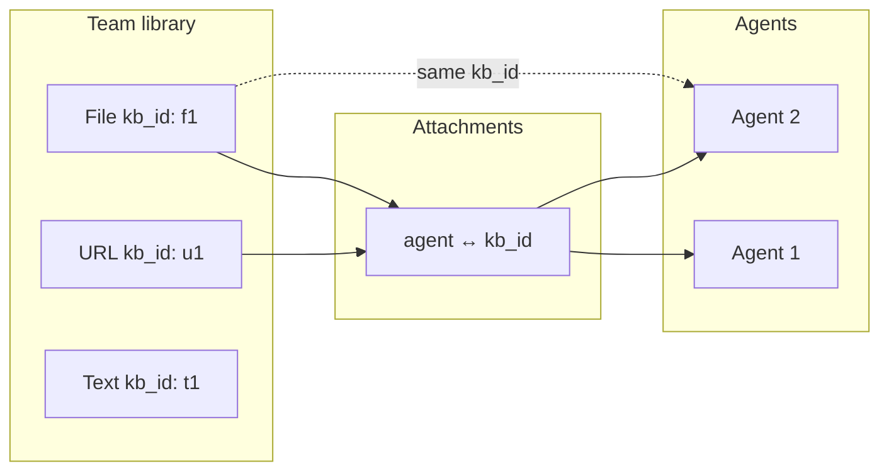
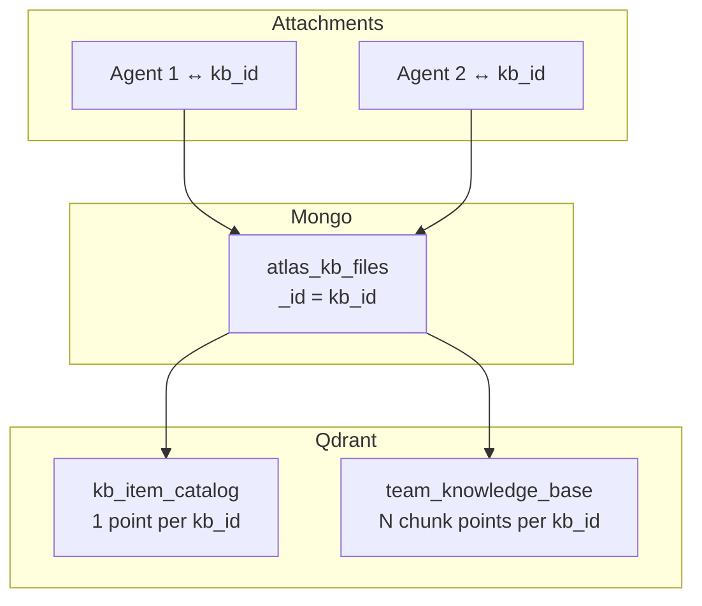
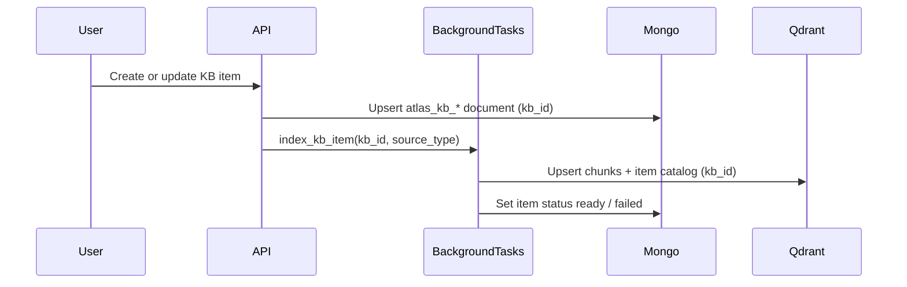

# Team-scoped knowledge items — architecture plan

**Status:** Planning only — implementation details and timeline TBD.

**Goal:** Decouple knowledge from individual agents. A team creates and indexes each knowledge item (URL, file, custom text, Q&A) once under its own `kb_id`; multiple agents attach that `kb_id` by reference instead of re-indexing the same content per agent.

**Legacy data:** Not in scope. Existing Mongo and Qdrant KB data has been cleared; we can design the new model without migration paths.

---

## Problem with the current model

Today, every knowledge source is owned by a single `agent_id`:

| Layer                 | Collections / storage                                                           | Ownership key                                       |
| --------------------- | ------------------------------------------------------------------------------- | --------------------------------------------------- |
| Mongo metadata        | `atlas_agent_urls`, `atlas_agent_files`, `atlas_custom_texts`, `atlas_qa_pairs` | `agent_id`                                          |
| Qdrant chunks         | `agent_knowledge_base`                                                          | `agent_id` + `knowledge_source`                     |
| Qdrant item summaries | `agent_web_catalog`                                                             | `agent_id` + `url` (URL-only; dropped in new model) |
| S3                    | Paths under `agents/{agent_id}/...`                                             | `agent_id`                                          |

Consequences:

- Uploading the same PDF to two agents indexes it twice (embeddings, Mongo rows, S3 copies).
- Updating an agent's knowledge re-runs indexing even when the underlying content is unchanged.
- There is no team-level reusable knowledge library.

---

## Target model (high level)


```mermaid
flowchart LR
    subgraph Team library
        F1["File kb_id: f1"]
        U1["URL kb_id: u1"]
        T1["Text kb_id: t1"]
    end

    subgraph Attachments
        L1["agent ↔ kb_id"]
    end

    subgraph Agents
        A1[Agent 1]
        A2[Agent 2]
    end

    F1 --> L1
    U1 --> L1
    L1 --> A1
    L1 --> A2
    F1 -.->|"same kb_id"| A2
```

**Core ideas:**

1. **`kb_id` = one knowledge item** — each URL, file, custom text, or Q&A pair is its own indexed unit. Document `_id` in the source collection **is** the `kb_id`. There is **no** parent `atlas_knowledge_bases` shell collection.
2. **Team-scoped items** — every item document carries `team_id` for RBAC and listing.
3. **Agents attach `kb_id`s via a junction collection** — many-to-many between agents and items; **do not** store `kb_ids` on `atlas_agents` (unlike `tool_ids`).
4. **Index once per item** — embedding runs when the item is created or updated, not when an agent attaches it.
5. **Query by union** — at chat/retrieval time, resolve attached `kb_id`s for the agent, then search Qdrant with `kb_id IN (...)`.

**Sharing:** One file with `kb_id = f1` attached to three agents = **one** Mongo row, **one** Qdrant index, **three** rows in `atlas_agent_kb_attachments`.

---

## Proposed data model

### 1. Mongo — collections (decided)

**No `atlas_knowledge_bases`.** Five collections total: four item stores + one attachment junction.

| Collection                   | Role                                               |
| ---------------------------- | -------------------------------------------------- |
| `atlas_kb_urls`              | One document per URL item; `_id` = `kb_id`         |
| `atlas_kb_files`             | One document per file item; `_id` = `kb_id`        |
| `atlas_kb_custom_texts`      | One document per custom text item; `_id` = `kb_id` |
| `atlas_kb_qa_pairs`          | One document per Q&A item; `_id` = `kb_id`         |
| `atlas_agent_kb_attachments` | Which `kb_id`s are attached to which agents        |

Module-level constants:

```python
KB_URLS_COLLECTION = "atlas_kb_urls"
KB_FILES_COLLECTION = "atlas_kb_files"
KB_CUSTOM_TEXTS_COLLECTION = "atlas_kb_custom_texts"
KB_QA_PAIRS_COLLECTION = "atlas_kb_qa_pairs"
AGENT_KB_ATTACHMENTS_COLLECTION = "atlas_agent_kb_attachments"
```

#### Item collections (`atlas_kb_*`)

Each document is a **standalone knowledge item**. Legacy agent-scoped collections map as follows:

| Legacy (agent-scoped) | New (item-scoped)       |
| --------------------- | ----------------------- |
| `atlas_agent_urls`    | `atlas_kb_urls`         |
| `atlas_agent_files`   | `atlas_kb_files`        |
| `atlas_custom_texts`  | `atlas_kb_custom_texts` |
| `atlas_qa_pairs`      | `atlas_kb_qa_pairs`     |

**Common fields on every item document:**

| Field                       | Purpose                                                                |
| --------------------------- | ---------------------------------------------------------------------- |
| `_id`                       | `kb_id` (ObjectId string)                                              |
| `team_id`                   | Owning team — required for RBAC and team library APIs                  |
| `status`                    | `draft` \| `indexing` \| `ready` \| `failed` — per-item indexing state |
| `created_by_user_id`        | Audit                                                                  |
| `created_at` / `updated_at` | Timestamps                                                             |

Plus type-specific fields — e.g. `url`, `file_key`, `file_name`, `custom_text_alias`, **`content`** (custom text), `qna_alias`, **`question`**, **`answer`** (Q&A). Full text lives in **Mongo**; Qdrant stores chunks and catalog summary only. No `agent_id`.

**Resolving a `kb_id`:** globally unique `_id`; use `source_type` on the attachment row (or a team index/registry later) to know which of the four collections to read.

#### Agent ↔ KB attachments (`atlas_agent_kb_attachments`)

Junction collection for many-to-many agent ↔ item links.

**Example document:**

```json
{
  "_id": "679...",
  "agent_id": "674...",
  "kb_id": "675...",
  "team_id": "673...",
  "source_type": "file",
  "attached_by_user_id": "672...",
  "attached_at": "2026-06-24T10:00:00Z"
}
```

| Field                                 | Purpose                                                                                      |
| ------------------------------------- | -------------------------------------------------------------------------------------------- |
| `agent_id`                            | Agent receiving the knowledge item                                                           |
| `kb_id`                               | Item `_id` in one of the `atlas_kb_*` collections                                            |
| `team_id`                             | Denormalized — must match both agent and item `team_id`                                      |
| `source_type`                         | `url` \| `file` \| `custom_text` \| `qa_pair` — avoids scanning all four collections on read |
| `attached_by_user_id` / `attached_at` | Audit                                                                                        |

**Indexes:**

- Unique compound: `(agent_id, kb_id)` — one attachment per pair
- `(agent_id, attached_at)` — list items attached to an agent
- `(kb_id)` — find all agents using an item (delete / impact analysis)
- `(team_id, agent_id)` — team-scoped agent attachment queries

**Attach validation:**

1. Agent exists and caller has access.
2. Item exists in the collection implied by `source_type`.
3. Item `team_id` == agent `team_id`.
4. Upsert attachment row; **no re-index** on attach.

**Detach:** delete attachment row only; item and Qdrant data remain for other agents.

**`atlas_agents`:** unchanged for knowledge — no `kb_ids` array on the agent document.

### 2. Qdrant — collections (decided)

Two team-wide collections. **No `agent_id` on any point** — agent scope is resolved at query time via `atlas_agent_kb_attachments` → `kb_id IN (...)`.

Drop legacy collections: `agent_knowledge_base`, `agent_web_catalog` (no backfill).

| Collection            | Role                                                      | Granularity                     | Vector source  |
| --------------------- | --------------------------------------------------------- | ------------------------------- | -------------- |
| `team_knowledge_base` | Chunk store (replaces `agent_knowledge_base`)             | Many points per item            | `text_content` |
| `kb_item_catalog`     | Item summaries for routing (replaces `agent_web_catalog`) | **Exactly 1 point per `kb_id`** | `summary`      |

Embedding: `text-embedding-3-small`, dimension **1536**, distance **cosine** (same as today).

Module-level constants:

```python
TEAM_KNOWLEDGE_BASE_COLLECTION = "team_knowledge_base"
KB_ITEM_CATALOG_COLLECTION = "kb_item_catalog"
EMBEDDING_DIM = 1536
EMBEDDING_MODEL = "text-embedding-3-small"
```


```mermaid
flowchart TB
    subgraph Mongo
        F["atlas_kb_files<br/>_id = kb_id"]
    end

    subgraph Qdrant
        C["kb_item_catalog<br/>1 point per kb_id"]
        K["team_knowledge_base<br/>N chunk points per kb_id"]
    end

    subgraph Attachments
        A1["Agent 1 ↔ kb_id"]
        A2["Agent 2 ↔ kb_id"]
    end

    F --> C
    F --> K
    A1 --> F
    A2 --> F
```

**Sharing:** one file (`kb_id = f1`) attached to two agents → **one** catalog point + **one** chunk set in Qdrant; attach/detach only changes Mongo.

#### `team_knowledge_base` — chunks

**Point ID:** deterministic for idempotent re-index: `{kb_id}::chunk::{text_index}`

**Example point:**

```json
{
  "id": "675a1f...::chunk::0",
  "vector": [1536 floats],
  "payload": {
    "kb_id": "675a1f2b3c4d5e6f7a8b9c0d",
    "team_id": "673...",
    "source_type": "file",
    "knowledge_source": "teams/acme/kb_items/675a.../files/handbook.pdf",
    "text_index": 0,
    "text_content": "Leave policy: full-time employees receive...",
    "knowledge_type": "file_content",
    "created_at": "2026-06-24T10:00:00Z"
  }
}
```

| Payload field      | Required | Notes                                                        |
| ------------------ | -------- | ------------------------------------------------------------ |
| `kb_id`            | yes      | Primary filter key — matches Mongo item `_id`                |
| `team_id`          | yes      | Bulk delete / admin; not used in normal agent retrieval      |
| `source_type`      | yes      | `url` \| `file` \| `custom_text` \| `qa_pair`                |
| `knowledge_source` | yes      | URL, S3 key, or alias — display and debug                    |
| `text_index`       | yes      | `0, 1, 2, ...` within this item                              |
| `text_content`     | yes      | Chunk text (embedding source)                                |
| `knowledge_type`   | no       | e.g. `web_content`, `file_content`, `custom_text`, `qa_pair` |
| `created_at`       | no       | ISO timestamp                                                |

**Payload indexes:** `kb_id` (required), `team_id`, `source_type` (optional).

#### `kb_item_catalog` — one summary per item

Replaces `agent_web_catalog` for **all** source types (not URL-only). With per-item `kb_id`, there is always exactly one catalog point per knowledge item.

**Point ID:** use `kb_id` directly (natural upsert on re-index).

**Example point (URL):**

```json
{
  "id": "675a1f2b3c4d5e6f7a8b9c0d",
  "vector": [1536 floats],
  "payload": {
    "kb_id": "675a1f2b3c4d5e6f7a8b9c0d",
    "team_id": "673...",
    "source_type": "url",
    "knowledge_source": "https://acme.com/pricing",
    "title": "Pricing page",
    "summary": "Covers subscription tiers, annual vs monthly billing, and enterprise sales contact. Mentions free trial length and refund policy.",
    "metadata": {
      "page_type": "content",
      "product_name": null,
      "category": null,
      "price": null,
      "currency": null,
      "is_available": null
    },
    "chunk_count": 12,
    "created_at": "2026-06-24T10:00:00Z",
    "updated_at": "2026-06-24T10:00:00Z"
  }
}
```

| Payload field               | Required | Notes                                                 |
| --------------------------- | -------- | ----------------------------------------------------- |
| `kb_id`                     | yes      | Same as point ID                                      |
| `team_id`                   | yes      |                                                       |
| `source_type`               | yes      |                                                       |
| `knowledge_source`          | yes      | Canonical key from Mongo                              |
| `title`                     | no       | File name, URL label, text alias, or question preview |
| `summary`                   | yes      | 2–3 dense sentences — **embedding source**            |
| `metadata`                  | no       | Type-specific extras (see below)                      |
| `chunk_count`               | no       | UI / debugging                                        |
| `created_at` / `updated_at` | no       |                                                       |

**`metadata` by `source_type`:**

| `source_type` | `metadata` fields                                                                                                                        |
| ------------- | ---------------------------------------------------------------------------------------------------------------------------------------- |
| `url`         | `page_type`, `product_name`, `product_id`, `category`, `price`, `currency`, `is_available` (product pages; same idea as old web catalog) |
| `file`        | `file_name`, `mime_type`, `page_count`                                                                                                   |
| `custom_text` | `custom_text_alias`                                                                                                                      |
| `qa_pair`     | `qna_alias`, `question_preview`                                                                                                          |

**Payload indexes:** `kb_id` (required), `team_id`, `source_type`.

#### Qdrant lifecycle

| Event                  | `kb_item_catalog`             | `team_knowledge_base`                           |
| ---------------------- | ----------------------------- | ----------------------------------------------- |
| Create / update item   | Upsert 1 point (`id = kb_id`) | Delete all points for `kb_id`, re-upsert chunks |
| Attach item to agent   | nothing                       | nothing                                         |
| Detach item from agent | nothing                       | nothing                                         |
| Delete item            | Delete by `kb_id` filter      | Delete by `kb_id` filter                        |

#### Legacy mapping

| Old                                        | New                                                        |
| ------------------------------------------ | ---------------------------------------------------------- |
| `agent_knowledge_base`                     | `team_knowledge_base`                                      |
| `agent_web_catalog`                        | `kb_item_catalog`                                          |
| `agent_id` on every point                  | removed — scope via attachments                            |
| `knowledge_source` as primary grouping key | `kb_id` is sufficient; keep `knowledge_source` for display |

### 3. S3 — path convention

Paths keyed by item `kb_id` (not a parent KB folder):

```
teams/{team_id}/kb_items/{kb_id}/files/{file_name}
```

One upload per file item; all agents that attach that `kb_id` read the same object.

---

## Phase 1 implementation decisions (locked)

| Topic               | Decision                                                                                                         |
| ------------------- | ---------------------------------------------------------------------------------------------------------------- |
| Indexing transport  | FastAPI **BackgroundTasks** (not ARQ yet)                                                                        |
| List APIs           | **Separate** per type: `list-urls`, `list-files`, `list-custom-texts`, `list-qa-pairs`                           |
| URL create          | **Batch only** (`create-urls`) — one `kb_id` per URL                                                             |
| Custom text / Q&A   | **Full content in Mongo**; Qdrant = chunks + catalog summary only                                                |
| Alias uniqueness    | `custom_text_alias` / `qna_alias` unique per `team_id`                                                           |
| Re-index            | `POST /v1/reindex-item` (`kb_id` + `source_type`) for retry and fresh URL scrape                                 |
| Catalog summary     | **Per `source_type` LLM prompt**; embed **summary only**                                                         |
| Agent build/update  | **Strip** `links`, `files`, `custom_texts`, `qa_pairs` immediately; remove legacy agent datasource/indexing code |
| `query-agent` / RAG | **Deferred** — no retrieval wiring in phase 1                                                                    |
| File replace        | Same `kb_id`: presigned upload + `finalize-file` → re-index (see frontend guide)                                 |

**Frontend guide:** [frontend-kb-items-api-guide.md](./frontend-kb-items-api-guide.md)

### Reusable services (agent-inline create + attach — phase 2)

Users manage knowledge in a **dedicated team KB library** (phase 1 APIs). When creating or updating an agent (phase 2), two paths share the same service layer:

| Path                 | Flow                                                                                                                                                 |
| -------------------- | ---------------------------------------------------------------------------------------------------------------------------------------------------- |
| **Attach existing**  | Client sends `kb_ids` → `kb_attachment_service.attach_kb_items_to_agent(...)`                                                                        |
| **Inline new items** | Client sends links/files/texts/qa in the agent form → call `kb_item_services.create_*_for_team(...)` first → receive `kb_id`s → attach same as above |

**Do not** embed knowledge indexing inside `build-agent` / `update-agent`. Agent controllers orchestrate; `kb_item_services` + `kb_index_service` own create/update/index; `kb_attachment_service` owns the junction table.

Entry points in `services/elysium_atlas_services/kb_item/`:

- `kb_item_services.py` — team-scoped CRUD (`create_url_items_for_team`, `create_file_item_for_team`, `finalize_file_item`, etc.)
- `kb_index_service.py` — `index_kb_item(kb_id, source_type)` (BackgroundTasks today)
- `kb_attachment_service.py` — stub for `attach_kb_items_to_agent` / `detach` / `list_kb_ids_for_agent`

**File replace (Option A — locked):** keep the same `kb_id`; upload via `generate-presigned-urls` + `finalize-file` → re-index in place. Attachments and Qdrant point IDs stay stable.

---

## API surface (phase 1 — indexing & CRUD only)

**Base path:** `/elysium-agents/elysium-atlas/kb-items`

**In scope:** team library CRUD + indexing + re-index. **Out of scope:** `atlas_agent_kb_attachments`, `query-agent` retrieval.

| Endpoint                                                                        | Purpose                                                      |
| ------------------------------------------------------------------------------- | ------------------------------------------------------------ |
| `POST /v1/search-items`                                                         | Paginated substring search per `source_type`                 |
| `POST /v1/list-urls`                                                            | Paginated URL items                                          |
| `POST /v1/list-files`                                                           | Paginated file items                                         |
| `POST /v1/list-custom-texts`                                                    | Paginated custom text items                                  |
| `POST /v1/list-qa-pairs`                                                        | Paginated Q&A items                                          |
| `POST /v1/get-url` / `get-file` / `get-custom-text` / `get-qa-pair`             | Item detail (Mongo includes full text for custom text / Q&A) |
| `POST /v1/delete-url` / `delete-file` / `delete-custom-text` / `delete-qa-pair` | Delete item + Qdrant (+ S3 for files)                        |
| `POST /v1/create-urls`                                                          | Batch create URLs → one `kb_id` each → index                 |
| `POST /v1/update-url`                                                           | Update URL → re-index                                        |
| `POST /v1/create-file`                                                          | File shell (`draft`)                                         |
| `POST /v1/generate-presigned-urls`                                              | S3 upload URLs                                               |
| `POST /v1/finalize-file`                                                        | After S3 upload → index                                      |
| `POST /v1/create-custom-text` / `update-custom-text`                            | Mongo `content` + index                                      |
| `POST /v1/create-qa-pair` / `update-qa-pair`                                    | Mongo `question`/`answer` + index                            |
| `POST /v1/reindex-item`                                                         | Retry or refresh index for any item                          |

URL prep (`ping-url`, `scrape-urls`, `extract-url-links`) stays under `/elysium-atlas`.

**Code removal (phase 1):** agent knowledge on `build-agent`/`update-agent`, agent datasource routes, `atlas_url_index_services`, `atlas_files_index_services`, `atlas_custom_knowledge_services`, agent-scoped Qdrant indexing, `agent_knowledge_base` / `agent_web_catalog`.

---

## Retrieval & chat behavior

**Step 0 (always):** load attached `kb_id`s from `atlas_agent_kb_attachments` for the agent.

### Simple strategy

```
embed(query) → team_knowledge_base
  filter: kb_id IN [attached_kb_ids]
  limit: ~15–20
```

### Refined / two-stage strategy

```
embed(query) → kb_item_catalog
  filter: kb_id IN [attached_kb_ids]
  limit: ~8–10
  → top kb_ids

embed(query) → team_knowledge_base
  filter: kb_id IN [top_kb_ids from stage 1]
  limit: ~15
```

Stage 1 selects **which items** are relevant; stage 2 fetches **chunks** inside those items. Prefer two-stage when an agent has many attached items.

**Agent with zero attachments**

- Define explicit behavior: empty retrieval vs. block publish — decision TBD.

---

## Indexing pipeline (planned)


```mermaid
sequenceDiagram
    participant User
    participant API
    participant BG as BackgroundTasks
    participant Mongo
    participant Qdrant

    User->>API: Create or update KB item
    API->>Mongo: Upsert atlas_kb_* document (kb_id)
    API->>BG: index_kb_item(kb_id, source_type)
    BG->>Qdrant: Upsert chunks + item catalog (kb_id)
    BG->>Mongo: Set item status ready / failed
```

- Indexing runs via **FastAPI BackgroundTasks** (phase 1); ARQ optional later.
- Attaching an item to an agent does **not** enqueue indexing.
- Detaching does **not** delete Qdrant data.
- Deleting an item removes its vectors and all attachment rows for that `kb_id`.

Reuse existing scraping, chunking, embedding, and summary logic; change ownership keys and job entry points.

---

## What changes in the codebase (checklist for later)

| Area                               | Change                                                                                  |
| ---------------------------------- | --------------------------------------------------------------------------------------- |
| `routes/` / `controllers/`         | Team item CRUD routes; agent attach/detach routes                                       |
| `services/elysium_atlas_services/` | KB item services; attachment service; refactor index/query                              |
| `qdrant_collection_helpers.py`     | `team_knowledge_base` + `kb_item_catalog` constants, ensure-collection, payload indexes |
| `mongo_indexes.py`                 | Indexes on `atlas_kb_*.team_id`, `atlas_agent_kb_attachments`                           |
| `jobs/`                            | Item-scoped indexing tasks                                                              |
| `agent_services.py`                | Build/update no longer index inline sources                                             |
| `atlas_query_qdrant_services.py`   | Resolve `kb_id`s from attachments, then filter Qdrant                                   |
| Frontend guides                    | New team library + attach API guide; update create/update and datasource docs           |

---

## Non-goals (for this phase)

- Migrating legacy `agent_id`-keyed data (already deleted).
- Cross-team item sharing.
- Named "knowledge base" folders / grouping multiple items under one parent ID (may come later via tags or collections UX).
- Item versioning / snapshots.
- Per-agent content overrides on the same `kb_id`.
- Detailed endpoint specs, Pydantic schemas, and rollout timeline.

---

## Open decisions (to resolve before / during implementation)

1. **File replace UX** — **resolved:** same `kb_id` via presigned + `finalize-file` → re-index (Option A). Open: delete old S3 object on replace?
2. **`kb_id` lookup helper** — require `source_type` on reindex vs lightweight `atlas_kb_items` index (optional).
3. **Retrieval defaults** — simple vs two-stage catalog routing (when `query-agent` is wired).
4. **List responses** — include `summary` on list rows or get-only.

---

## Success criteria

- A file indexed once under `kb_id` f1 is searchable from every agent with an attachment row pointing at f1.
- Creating a second agent and attaching existing `kb_id`s adds **no** re-embedding work.
- Updating agent name, model, or tools does not re-index knowledge items.
- Attaching or detaching `kb_id`s on an agent does not re-index.
- Team isolation enforced: users cannot attach or query items outside their `team_id`.

---

## Related docs

- [agents-datasource.md](./agents-datasource.md) — current agent-scoped list APIs (will change)
- [frontend-agent-create-update-api-guide.md](./frontend-agent-create-update-api-guide.md) — current build/update flow (will change)
- [frontend-agents-rbac-guide.md](./frontend-agents-rbac-guide.md) — team RBAC patterns to reuse for KB APIs
- [team-kb-retrieval.md](./team-kb-retrieval.md) — chat-time RAG retrieval (simple mode)
